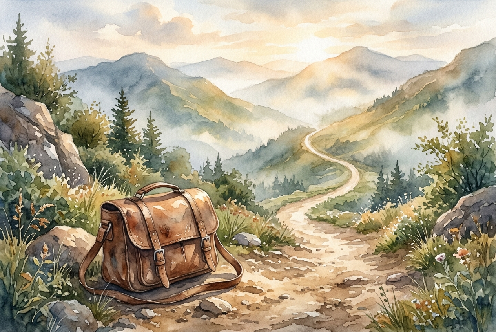

# Daily Reading: Hebrews 12:1-3

*June 12, 2026*

> *(Image: A single, worn leather satchel resting on the edge of a dusty, sunlit path that winds upward into a quiet, misty mountain range.)*

## The Reading (NLT)

**Hebrews 12:1-3**

> 1 Therefore, since we are surrounded by such a huge crowd of witnesses to the life of faith, let us strip off every weight that slows us down, especially the sin that so easily trips us up. And let us run with endurance the race God has set before us. 2 We do this by keeping our eyes on Jesus, the champion who initiates and perfects our faith. Because of the joy awaiting him, he endured the cross, disregarding its shame. Now he is seated in the place of honor beside God's throne. 3 Think of all the hostility he endured from sinful people; then you won't become weary and give up.

## The Story

The original audience of this letter was exhausted. They were early believers facing severe social and economic pressure, and many were tempted to simply walk away from their faith to find relief. To encourage them, the author uses the vivid imagery of a Greco-Roman athletic contest. In these ancient stadiums, runners would strip off all excess clothing and heavy gear to move as freely as possible. The stands are described as filled with the faithful people from history who have already completed their own grueling events. The ultimate model for this endurance is Christ himself, who faced profound opposition and humiliation without losing sight of the ultimate goal.

## Application for Today

In our own spiritual lives, we accumulate a lot of unnecessary baggage. We pick up the heavy expectations of others, the desire for social status, and habits that slowly drain our energy. When we try to carry all of this while navigating life's challenges, exhaustion is inevitable. The invitation here is to ruthlessly evaluate what we are carrying and drop anything that hinders our forward motion. Instead of looking around at how fast others are moving or what they are carrying, we are directed to look straight ahead. By fixing our attention on the one who already endured the ultimate hostility, we find the steady rhythm needed to keep moving forward without losing heart.

---

*Scripture quotations are taken from the Holy Bible, New Living Translation, copyright © 1996, 2004, 2015 by Tyndale House Foundation. Used by permission of Tyndale House Publishers.*
