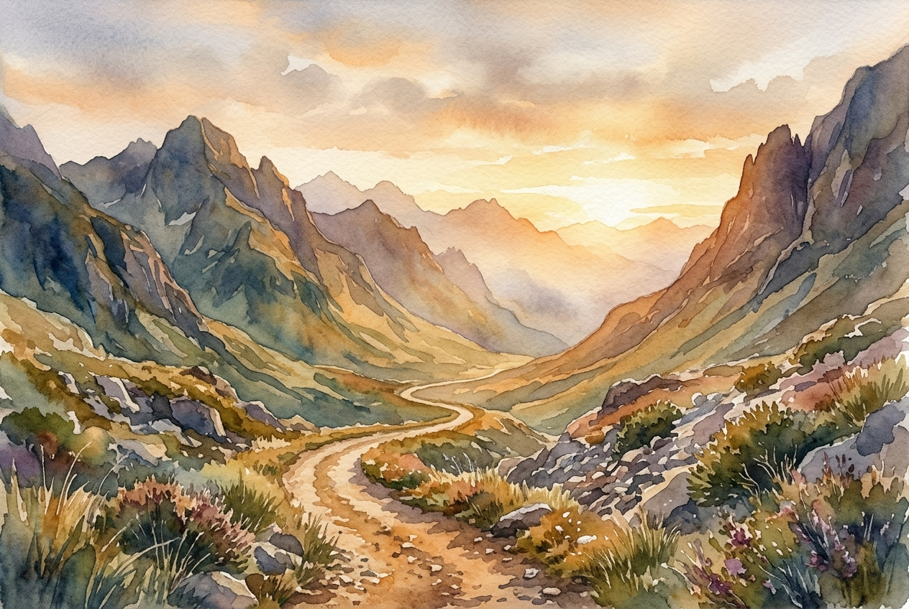

# Leitura Diária: Psalm 121

*13 de junho de 2026*

> *(Image: A winding dirt path through a rugged mountain pass, bathed in the soft and protective golden light of early dawn.)*

## A Leitura (PT-NVI)

**Psalm 121**

> 1 Levanto os meus olhos para os montes e pergunto: De onde me vem o socorro? 2 O meu socorro vem do Senhor, que fez os céus e a terra. 3 Ele não permitirá que você tropece; o seu protetor se manterá alerta, 4 sim, o protetor de Israel não dormirá, ele está sempre alerta! 5 O Senhor é o seu protetor; como sombra que o protege, ele está à sua direita. 6 De dia o sol não o ferirá, nem a lua, de noite. 7 O Senhor o protegerá de todo o mal, protegerá a sua vida. 8 O Senhor protegerá a sua saída e a sua chegada, desde agora e para sempre.

## A História

Os antigos peregrinos que viajavam para Jerusalém enfrentavam rotas traiçoeiras. Os caminhos serpenteavam por terrenos íngremes e rochosos onde bandidos costumavam se esconder, tornando as elevações ao redor uma fonte de profunda ansiedade. Quando o autor deste cântico examina esses picos, a questão da sobrevivência é muito real. No entanto, em vez de buscar conforto na paisagem ou em seus próprios preparativos de viagem, ele olha inteiramente além do mundo físico. Ele reconhece que a verdadeira segurança pertence àquele que projetou os picos e os vales desde o princípio. A canção muda da ansiedade de um viajante solitário para uma declaração de confiança profunda em um Criador que nunca abandona seu posto.

## Aplicação para Hoje

Ainda navegamos por cenários cheios de perigos ocultos, quer eles assumam a forma de instabilidade financeira, crises de saúde ou rupturas nos relacionamentos. É incrivelmente fácil examinar o horizonte em busca de um resgate rápido ou depender completamente de nossos próprios planos de contingência. Esta passagem nos convida a elevar o nosso olhar. A garantia oferecida aqui não é que a estrada estará totalmente livre de pedras ou vales escuros, mas que nunca caminhamos sem sermos vistos. Aquele que colocou as estrelas em movimento está intimamente atento às nossas partidas e chegadas diárias. Podemos descansar na confiança silenciosa de que o nosso bem-estar final é sustentado por mãos que nunca se cansam.

---

*Citações bíblicas extraídas da Nova Versão Internacional (NVI), © 1993, 2000 por Biblica, Inc. Usado com permissão.*
