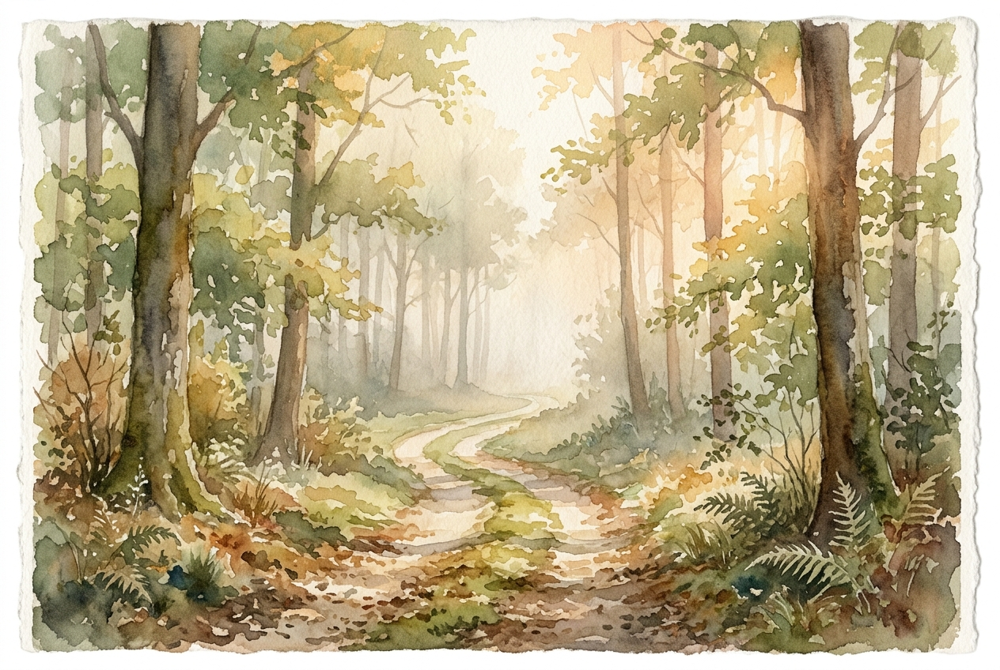

# Daily Reading: Proverbs 3:5-8

*June 14, 2026*

> *(Image: A quiet forest path bathed in soft morning light, with a gentle mist obscuring the distant trees, symbolizing an unknown but peaceful journey.)*

## The Reading (NLT)

**Proverbs 3:5-8**

> 5 Trust in the Lord with all your heart; do not depend on your own understanding. 6 Seek his will in all you do, and he will show you which path to take. 7 Don't be impressed with your own wisdom. Instead, fear the Lord and turn away from evil. 8 Then you will have healing for your body and strength for your bones.

## The Story

The ancient wisdom literature of Israel often wrestles with the limits of human intellect. In a culture surrounded by nations claiming to possess secret knowledge and magical foresight, the wisdom teachers of Proverbs offered a radical alternative. They suggested that true stability does not come from having life entirely figured out or relying solely on personal intellect. Instead, they pointed toward a posture of deep, reverent surrender to the Creator. The physical vitality mentioned by these ancient writers reflects the profound bodily relief that comes when a person stops carrying the weight of the world on their own shoulders.

## Application for Today

We live in an era that prizes data, predictability, and being the smartest person in the room. When faced with difficult decisions, our first instinct is usually to analyze every possible outcome until we are paralyzed by anxiety. This ancient guidance invites us to step back from the edge of overthinking. Surrendering our need for total control opens up a different kind of clarity, one rooted in relationship rather than raw intellect. When we stop trying to outsmart our circumstances and choose instead to walk humbly with God, we often find a deep, restorative peace that brings wellness to our entire being.

---

*Scripture quotations are taken from the Holy Bible, New Living Translation, copyright © 1996, 2004, 2015 by Tyndale House Foundation. Used by permission of Tyndale House Publishers.*
