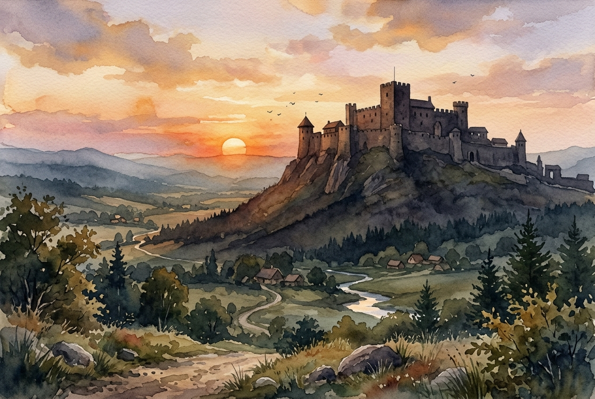

# Daily Reading: Psalm 91

*June 14, 2026*

> *(Image: A serene watercolor landscape showing a massive ancient stone fortress casting a long deep shadow over a quiet valley at sunset.)*

## The Reading (NLT)

**Psalm 91**

> 1 Those who live in the shelter of the Most High will find rest in the shadow of the Almighty. 2 This I declare about the Lord: He alone is my refuge, my place of safety; he is my God, and I trust him. 3 For he will rescue you from every trap and protect you from deadly disease. 4 He will cover you with his feathers. He will shelter you with his wings. His faithful promises are your armor and protection. 5 Do not be afraid of the terrors of the night, nor the arrow that flies in the day. 6 Do not dread the disease that stalks in darkness, nor the disaster that strikes at midday. 7 Though a thousand fall at your side, though ten thousand are dying around you, these evils will not touch you. 8 Just open your eyes, and see how the wicked are punished. 9 If you make the Lord your refuge, if you make the Most High your shelter, 10 no evil will conquer you; no plague will come near your home. 11 For he will order his angels to protect you wherever you go. 12 They will hold you up with their hands so you won't even hurt your foot on a stone. 13 You will trample upon lions and cobras; you will crush fierce lions and serpents under your feet! 14 The Lord says, I will rescue those who love me. I will protect those who trust in my name. 15 When they call on me, I will answer; I will be with them in trouble. I will rescue and honor them. 16 I will reward them with a long life and give them my salvation.

## The Story

The ancient poets of Israel understood that the world was a deeply unpredictable place. This psalm was likely sung by pilgrims or soldiers facing very real physical dangers on their journeys. Rather than denying the existence of sudden disasters or hidden traps, the writer acknowledges the full spectrum of human vulnerability. Yet the song shifts the focus away from these threats and toward the ultimate security found in the divine presence. Drawing on imagery of a bird shielding its young, the text paints a picture of fierce enveloping care. The final verses change perspective entirely, offering a direct promise from the divine voice to remain close during times of trouble.

## Application for Today

We spend so much energy trying to anticipate and neutralize every possible threat in our lives. We obsess over potential crises and hidden dangers, hoping that enough preparation will keep us completely secure. This passage invites us to lay down that exhausting vigilance. The promise here is not that we will never encounter hardship, but that we do not have to face the unpredictability of life exposed and alone. When we choose to make the divine presence our daily habitat, we find a profound layer of peace that circumstances cannot disrupt. We can rest in a shelter that holds us securely, even when the world around us feels chaotic.

---

*Scripture quotations are taken from the Holy Bible, New Living Translation, copyright © 1996, 2004, 2015 by Tyndale House Foundation. Used by permission of Tyndale House Publishers.*
