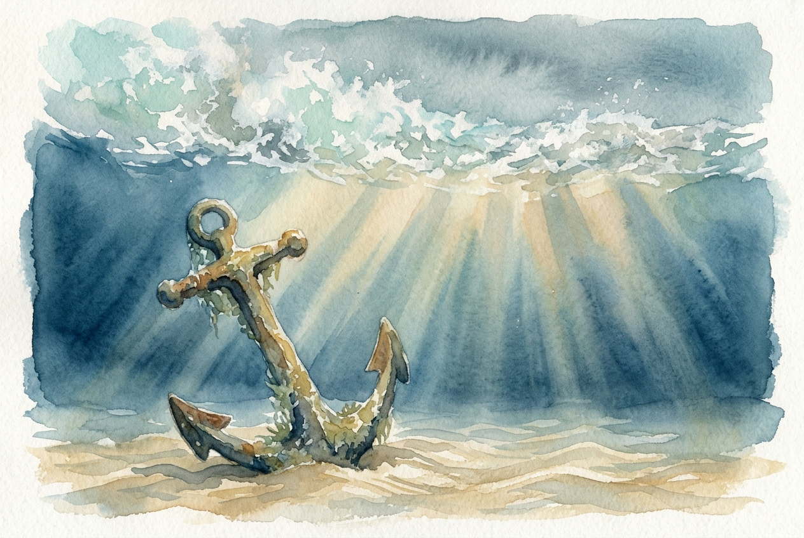

# Daily Reading: James 1:2-8

*June 16, 2026*

> *(Image: A heavy weathered iron anchor resting peacefully on the sandy ocean floor while turbulent waves crash on the surface far above illuminated by shafts of sunlight piercing through the deep blue water.)*

## The Reading (NLT)

**James 1:2-8**

> 2 Dear brothers and sisters, when troubles of any kind come your way, consider it an opportunity for great joy. 3 For you know that when your faith is tested, your endurance has a chance to grow. 4 So let it grow, for when your endurance is fully developed, you will be perfect and complete, needing nothing. 5 If you need wisdom, ask our generous God, and he will give it to you. He will not rebuke you for asking. 6 But when you ask him, be sure that your faith is in God alone. Do not waver, for a person with divided loyalty is as unsettled as a wave of the sea that is blown and tossed by the wind. 7 Such people should not expect to receive anything from the Lord. 8 Their loyalty is divided between God and the world, and they are unstable in everything they do.

## The Story

Writing to scattered communities facing intense social and economic pressure, the author of this letter introduces a startling perspective on hardship. Instead of viewing difficulties as signs of divine abandonment, the early church is urged to recognize them as the very soil where spiritual maturity grows. Because navigating such pressure requires immense discernment, the text points these believers toward a Creator who responds to their lack of understanding with pure generosity. The imagery used here is elemental and stark: a mind split between trusting God and trusting the world's systems is like the ocean surface, endlessly manipulated by weather. The call is toward an integrated, single-minded reliance on the Divine.

## Application for Today

We rarely welcome the difficult seasons of our lives, often viewing them simply as obstacles to be removed. Yet, we are invited here to see the friction of our daily challenges as a shaping force that builds lasting endurance. When the path forward is obscured by the fog of a crisis, our most vital response is to ask for direction. We can approach God with our profound lack of answers, confident that we will be met with grace rather than criticism. The work on our part is to remain anchored. When we allow our focus to be constantly divided by fear or shifting cultural currents, we lose our footing. True stability is found when we gather our fragmented loyalties and trust entirely in the One who holds us steady.

---

*Scripture quotations are taken from the Holy Bible, New Living Translation, copyright © 1996, 2004, 2015 by Tyndale House Foundation. Used by permission of Tyndale House Publishers.*
