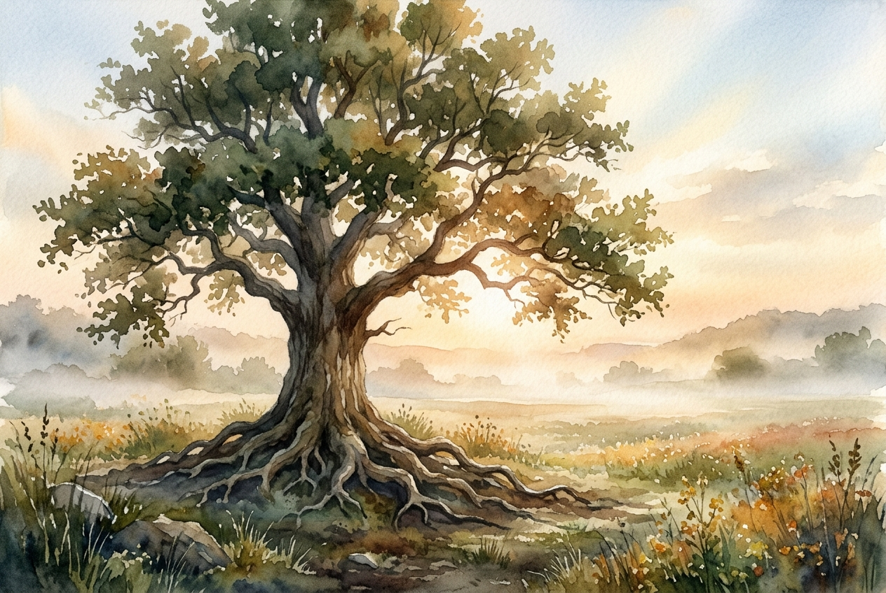

# Daily Reading: 1 Corinthians 13

*June 16, 2026*

> *(Image: A single sturdy oak tree standing in a wide field, its deep roots gripping the earth while gentle morning light breaks through the thick mist.)*

## The Reading (NLT)

**1 Corinthians 13**

> 1 If I could speak all the languages of earth and of angels, but didn't love others, I would only be a noisy gong or a clanging cymbal. 2 If I had the gift of prophecy, and if I understood all of God's secret plans and possessed all knowledge, and if I had such faith that I could move mountains, but didn't love others, I would be nothing. 3 If I gave everything I have to the poor and even sacrificed my body, I could boast about it; but if I didn't love others, I would have gained nothing. 4 Love is patient and kind. Love is not jealous or boastful or proud 5 or rude. It does not demand its own way. It is not irritable, and it keeps no record of being wronged. 6 It does not rejoice about injustice but rejoices whenever the truth wins out. 7 Love never gives up, never loses faith, is always hopeful, and endures through every circumstance. 8 Prophecy and speaking in unknown languages and special knowledge will become useless. But love will last forever! 9 Now our knowledge is partial and incomplete, and even the gift of prophecy reveals only part of the whole picture! 10 But when the time of perfection comes, these partial things will become useless. 11 When I was a child, I spoke and thought and reasoned as a child. But when I grew up, I put away childish things. 12 Now we see things imperfectly, like puzzling reflections in a mirror, but then we will see everything with perfect clarity. All that I know now is partial and incomplete, but then I will know everything completely, just as God now knows me completely. 13 Three things will last forever faith, hope, and love and the greatest of these is love.

## The Story

Paul wrote this famous letter to a community tearing itself apart over status and spiritual achievements. The Christians in Corinth were obsessed with who had the most impressive abilities, the deepest knowledge, or the most profound faith. In response, Paul completely reframes their value system. He argues that even the most spectacular displays of religious devotion are entirely hollow without a foundation of active, self-giving care for others. He describes a kind of love that is not a fleeting emotion, but a resilient choice to seek the good of another. This love outlasts temporary spiritual experiences and remains steady even when our understanding of the world is fragmented.

## Application for Today

We often measure our spiritual maturity by how much we know or how effectively we serve. Yet this passage challenges us to look instead at how we handle frustration, disruption, and interpersonal friction. When life gets difficult and our circumstances are confusing, our knowledge and abilities often hit their limits. What carries us through those disorienting seasons is the quiet endurance of love. It is the steady choice to remain patient, to extend kindness, and to release our demand for control. Because our grasp of reality is currently limited, our primary calling is to anchor ourselves in the steady practice of caring for others.

---

*Scripture quotations are taken from the Holy Bible, New Living Translation, copyright © 1996, 2004, 2015 by Tyndale House Foundation. Used by permission of Tyndale House Publishers.*
