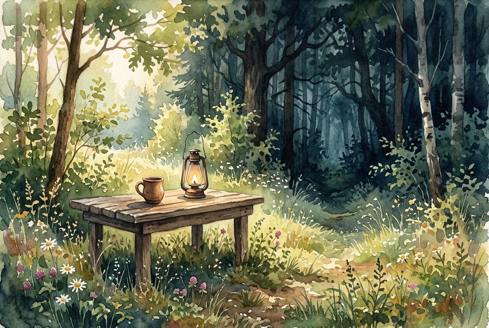

# Daily Reading: Psalm 23

*June 17, 2026*

> *(Image: A simple wooden table set with a single clay cup and a lit oil lamp, resting in a sunlit clearing at the edge of a dense, shadowy forest.)*

## The Reading (NLT)

**Psalm 23**

> 1 The Lord is my shepherd; I have all that I need. 2 He lets me rest in green meadows; he leads me beside peaceful streams. 3 He renews my strength. He guides me along right paths, bringing honor to his name. 4 Even when I walk through the darkest valley, I will not be afraid, for you are close beside me. Your rod and your staff protect and comfort me. 5 You prepare a feast for me in the presence of my enemies. You honor me by anointing my head with oil. My cup overflows with blessings. 6 Surely your goodness and unfailing love will pursue me all the days of my life, and I will live in the house of the Lord forever.

## The Story

The ancient Near Eastern imagery of a shepherd was a profound statement of royal care and intimate responsibility. Kings often called themselves shepherds of their people, but this song makes the relationship deeply personal. The journey described moves from idyllic landscapes into deep, shadowy terrain, reflecting the unpredictable reality of ancient nomadic life. Yet the focus shifts from being led from afar to being accompanied up close. Finally, the metaphor transitions from a pasture to a royal banquet, where ancient hospitality customs dictated that a host must protect and honor their guest at all costs.

## Application for Today

We often expect a life of faith to remain in the quiet meadows, far from danger or exhaustion. But true spiritual companionship is proven in the shadowy, uncertain places where our vulnerabilities are most exposed. The promise here is not an exemption from difficulty, but a quiet, steady presence that walks with us through it. When we feel surrounded by hostility or simply overwhelmed by life, we are invited to sit at a table prepared specifically for us. We do not have to fight for our own honor or safety; we are already deeply cared for, secure, and pursued by relentless goodness.

---

*Scripture quotations are taken from the Holy Bible, New Living Translation, copyright © 1996, 2004, 2015 by Tyndale House Foundation. Used by permission of Tyndale House Publishers.*
