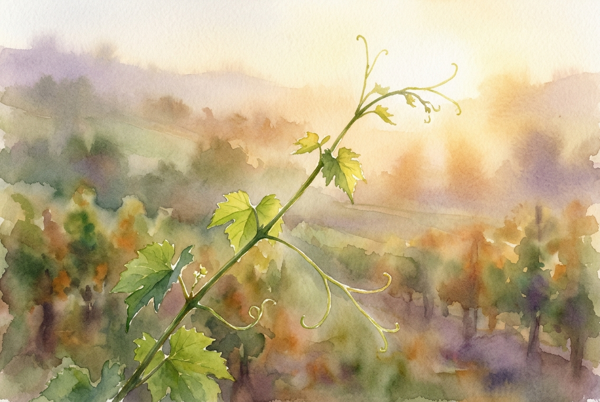

# Daily Reading: John 15:1-11

*June 17, 2026*

> *(Image: A close-up view of a vibrant green vine branch reaching toward warm golden morning light in a serene, softly blurred vineyard landscape.)*

## The Reading (NLT)

**John 15:1-11**

> 1 I am the true grapevine, and my Father is the gardener. 2 He cuts off every branch of mine that doesn't produce fruit, and he prunes the branches that do bear fruit so they will produce even more. 3 You have already been pruned and purified by the message I have given you. 4 Remain in me, and I will remain in you. For a branch cannot produce fruit if it is severed from the vine, and you cannot be fruitful unless you remain in me. 5 Yes, I am the vine; you are the branches. Those who remain in me, and I in them, will produce much fruit. For apart from me you can do nothing. 6 Anyone who does not remain in me is thrown away like a useless branch and withers. Such branches are gathered into a pile to be burned. 7 But if you remain in me and my words remain in you, you may ask for anything you want, and it will be granted! 8 When you produce much fruit, you are my true disciples. This brings great glory to my Father. 9 I have loved you even as the Father has loved me. Remain in my love. 10 When you obey my commandments, you remain in my love, just as I obey my Father's commandments and remain in his love. 11 I have told you these things so that you will be filled with my joy. Yes, your joy will overflow!

## The Story

In the ancient Mediterranean world, vineyards were everywhere, and tending them was a familiar, labor-intensive rhythm. A vine requires ruthless attention to thrive; a skilled gardener knows exactly which shoots are draining energy and which ones are ready to bear the harvest. The relationship between the central trunk and its sprawling branches is one of absolute dependence. The branch doesn't strive to create grapes; it simply acts as a conduit for the life flowing from the root. The listeners would have understood that this agricultural metaphor was really about intimacy and survival. To be disconnected from the source was to lose all vitality.

## Application for Today

We often treat our spiritual lives as a series of tasks to accomplish or moral goals to achieve through sheer willpower. But this passage invites us into a completely different posture: remaining. True growth doesn't come from exhausting ourselves trying to produce results, but from staying deeply connected to the source of love. Even the painful seasons of pruning, when distractions or even good things are stripped away, are the careful work of hands that want us to flourish. When we settle into that abiding presence, we find that joy and purpose naturally follow. Our only real job is to stay close.

---

*Scripture quotations are taken from the Holy Bible, New Living Translation, copyright © 1996, 2004, 2015 by Tyndale House Foundation. Used by permission of Tyndale House Publishers.*
