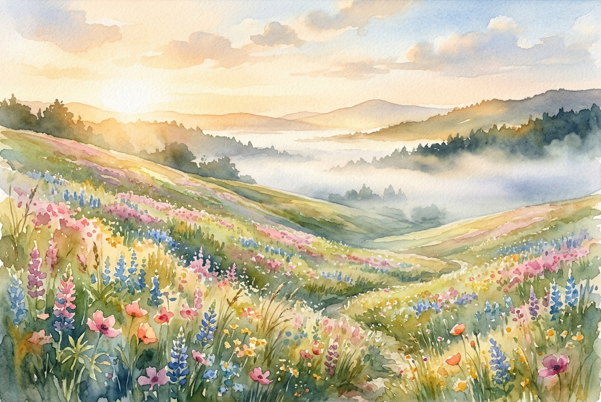

# Daily Reading: Matthew 5:1-12

*June 18, 2026*

> *(Image: A serene, rolling hillside covered in vibrant wildflowers bathed in soft golden morning light, with a gentle mist resting peacefully in the valley below.)*

## The Reading (NLT)

**Matthew 5:1-12**

> 1 One day as he saw the crowds gathering, Jesus went up on the mountainside and sat down. His disciples gathered around him, 2 and he began to teach them. 3 God blesses those who are poor and realize their need for him, for the Kingdom of Heaven is theirs. 4 God blesses those who mourn, for they will be comforted. 5 God blesses those who are humble, for they will inherit the whole earth. 6 God blesses those who hunger and thirst for justice, for they will be satisfied. 7 God blesses those who are merciful, for they will be shown mercy. 8 God blesses those whose hearts are pure, for they will see God. 9 God blesses those who work for peace, for they will be called the children of God. 10 God blesses those who are persecuted for doing right, for the Kingdom of Heaven is theirs. 11 God blesses you when people mock you and persecute you and lie about you and say all sorts of evil things against you because you are my followers. 12 Be happy about it! Be very glad! For a great reward awaits you in heaven. And remember, the ancient prophets were persecuted in the same way.

## The Story

Jesus sits on a hillside, adopting the traditional posture of a rabbi, to deliver his core teaching to a crowd of ordinary people. These listeners live under the heavy thumb of the Roman Empire, a society where success is measured by power, wealth, and military might. The prevailing culture insists that the strong survive and the ruthless conquer. Yet, the vision Jesus outlines presents a completely different reality. He describes an entirely new social order where honor belongs to those society typically overlooks or discards. He redefines what it means to live a flourishing life, completely upending the expectations of his day.

## Application for Today

We still live in a world that often rewards aggressive ambition and unyielding strength. It is easy to feel that kindness is a liability or that seeking reconciliation is a naive pursuit. But this hillside teaching invites us to view our daily interactions through a different lens. When we choose empathy over retaliation, or when we sit quietly with those who are grieving, we are actively building the reality Jesus described. Our quiet acts of care and our deep desire for things to be made right are not signs of weakness. They are the very foundation of a new way of living that quietly takes root right in the middle of our ordinary days.

---

*Scripture quotations are taken from the Holy Bible, New Living Translation, copyright © 1996, 2004, 2015 by Tyndale House Foundation. Used by permission of Tyndale House Publishers.*
