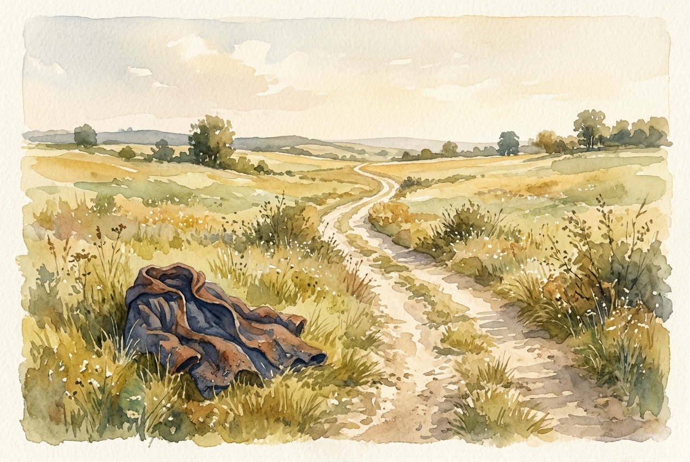

# Leitura Diária: Hebrews 12:1-3

*19 de junho de 2026*

> *(Image: A dusty, sunlit dirt path stretching forward through an open field, with a discarded heavy woolen cloak lying on the grass beside the trail.)*

## A Leitura (PT-NVI)

**Hebrews 12:1-3**

> 1 Portanto, também nós, uma vez que estamos rodeados por tão grande nuvem de testemunhas, livremo-nos de tudo o que nos atrapalha e do pecado que nos envolve, e corramos com perseverança a corrida que nos é proposta, 2 tendo os olhos fitos em Jesus, autor e consumador da nossa fé. Ele, pela alegria que lhe fora proposta, suportou a cruz, desprezando a vergonha, e assentou-se à direita do trono de Deus. 3 Pensem bem naquele que suportou tal oposição dos pecadores contra si mesmo, para que vocês não se cansem nem se desanimem.

## A História

O autor ilustra a jornada espiritual comparando-a a uma antiga competição atlética realizada em um estádio lotado. Os espectadores são gerações de fiéis que já completaram seus próprios caminhos difíceis. Para competir com eficácia, os leitores recebem instruções para descartar mantos pesados e qualquer coisa que possa fazê-los tropeçar na pista. A estratégia vencedora é manter os olhos fixos no pioneiro de seu caminho, que navegou com sucesso pelo sofrimento extremo e pela desgraça pública. Ele superou a agonia concentrando-se inteiramente na profunda alegria que o aguardava na linha de chegada, estabelecendo um exemplo perfeito para corredores exaustos.

## Aplicação para Hoje

Muitas vezes acumulamos bagagens emocionais e espirituais pesadas enquanto lidamos com nossas rotinas diárias. Ressentimentos, ansiedades e padrões destrutivos podem se enroscar em nossos tornozelos, fazendo com que cada movimento para frente pareça uma luta na lama profunda. Esta passagem nos convida a fazer um inventário honesto de nossos fardos e abandonar intencionalmente tudo o que drena nosso impulso. Quando a estrada se estende infinitamente e nossa energia desaparece, recebemos uma direção específica para onde olhar. Em vez de depender puramente de nossa própria força de vontade que se esgota, podemos extrair novo vigor daquele que já conquistou o percurso mais difícil. Sua resiliência se torna o combustível silencioso de que precisamos para simplesmente dar o próximo passo.

---

*Citações bíblicas extraídas da Nova Versão Internacional (NVI), © 1993, 2000 por Biblica, Inc. Usado com permissão.*
