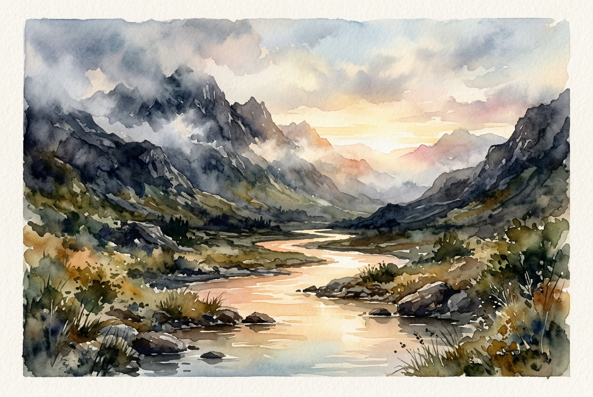

# Leitura Diária: Psalm 46

*20 de junho de 2026*

> *(Image: A tranquil, glowing river flowing peacefully through a rugged, storm-swept mountain valley at dawn.)*

## A Leitura (PT-NVI)

**Psalm 46**

> 1 Deus é o nosso refúgio e a nossa fortaleza, auxílio sempre presente na adversidade. 2 Por isso não temeremos, embora a terra trema e os montes afundem no coração do mar, 3 embora estrondem as suas águas turbulentas e os montes sejam sacudidos pela sua fúria. Pausa 4 Há um rio cujos canais alegram a cidade de Deus, o Santo Lugar onde habita o Altíssimo. 5 Deus nela está! Não será abalada! Deus vem em seu auxílio desde o romper da manhã. 6 Nações se agitam, reinos se abalam; ele ergue a voz, e a terra se derrete. 7 O Senhor dos Exércitos está conosco; o Deus de Jacó é a nossa torre segura. Pausa 8 Venham! Vejam as obras do Senhor, seus feitos estarrecedores na terra. 9 Ele dá fim às guerras até os confins da terra; quebra o arco e despedaça a lança, destrói os escudos com fogo. 10 "Parem de lutar! Saibam que eu sou Deus! Serei exaltado entre as nações, serei exaltado na terra. " 11 O Senhor dos Exércitos está conosco; o Deus de Jacó é a nossa torre segura. Pausa

## A História

Na poesia do antigo Oriente Médio, oceanos agitados e montanhas desmoronando eram os símbolos máximos do caos cósmico. Os cantores originais deste texto viviam em um reino minúsculo, constantemente ameaçado por impérios gigantescos e violentos. Para eles, o mundo frequentemente parecia estar desabando de forma literal. No entanto, bem no meio dessas imagens aterrorizantes, a poesia introduz um rio suave e cheio de vida que flui pela cidade onde o divino habita. Esse contraste destaca uma verdade profunda sobre a presença de Deus. Ele nem sempre impede que a terra trema, mas se apresenta como uma fortaleza segura durante a turbulência. A ordem para ficar em silêncio no final é, na verdade, um comando militar para baixar as armas e parar de lutar.

## Aplicação para Hoje

Todos nós passamos por fases em que o chão sob nossos pés parece instável. Seja por uma crise pessoal repentina ou pelo barulho ensurdecedor dos eventos globais, nosso instinto natural é entrar em pânico ou tentar resolver tudo com as próprias mãos. Este texto oferece um caminho diferente para seguirmos. Ele nos convida a reconhecer que nossa segurança não depende da nossa capacidade de controlar as circunstâncias ao nosso redor. Em vez de tentarmos desesperadamente manter tudo no lugar, somos chamados a abaixar nossas defesas. A verdadeira paz surge quando paramos de lutar com nossas próprias forças e confiamos que Deus já está presente, sendo um refúgio firme e silencioso no centro das nossas tempestades.

---

*Citações bíblicas extraídas da Nova Versão Internacional (NVI), © 1993, 2000 por Biblica, Inc. Usado com permissão.*
