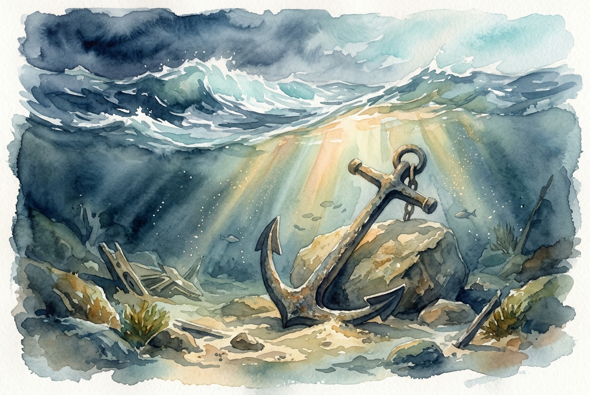

# Daily Reading: 1 Peter 5:6-11

*June 20, 2026*

> *(Image: A heavy, ancient iron anchor resting securely on a massive stone beneath turbulent ocean waves, illuminated by a single shaft of golden sunlight piercing the stormy water.)*

## The Reading (NLT)

**1 Peter 5:6-11**

> 6 So humble yourselves under the mighty power of God, and at the right time he will lift you up in honor. 7 Give all your worries and cares to God, for he cares about you. 8 Stay alert! Watch out for your great enemy, the devil. He prowls around like a roaring lion, looking for someone to devour. 9 Stand firm against him, and be strong in your faith. Remember that your family of believers all over the world is going through the same kind of suffering you are. 10 In his kindness God called you to share in his eternal glory by means of Christ Jesus. So after you have suffered a little while, he will restore, support, and strengthen you, and he will place you on a firm foundation. 11 All power to him forever! Amen.

## The Story

The early Christians receiving this letter were scattered across the ancient world, living as vulnerable minorities in a hostile empire. They faced daily social ostracism, economic hardship, and the looming threat of persecution. In this precarious environment, fear was a constant companion. The writer acknowledges their suffering without minimizing it, recognizing the very real forces working to consume their hope. Yet, he points them to a profound paradox: true resilience begins with letting go. Instead of trying to survive the hardship through sheer willpower, they are invited to release their heaviest burdens to a Creator who is intimately attentive to their pain.

## Application for Today

We often treat our worries as a measure of our responsibility, believing that if we just manage every detail, we can control the outcome. But carrying that immense load leaves us exhausted and vulnerable to despair. This passage invites us into a different posture. Embracing humility means admitting we do not have the power to outmaneuver every threat on our own. When we actively release our need for control, we make room for divine strength to sustain us. We are reminded that our struggles are shared by a wider human family, and that the current hardship is not the final word. Ultimately, God steps into the fray to rebuild, steady, and secure our footing.

---

*Scripture quotations are taken from the Holy Bible, New Living Translation, copyright © 1996, 2004, 2015 by Tyndale House Foundation. Used by permission of Tyndale House Publishers.*
