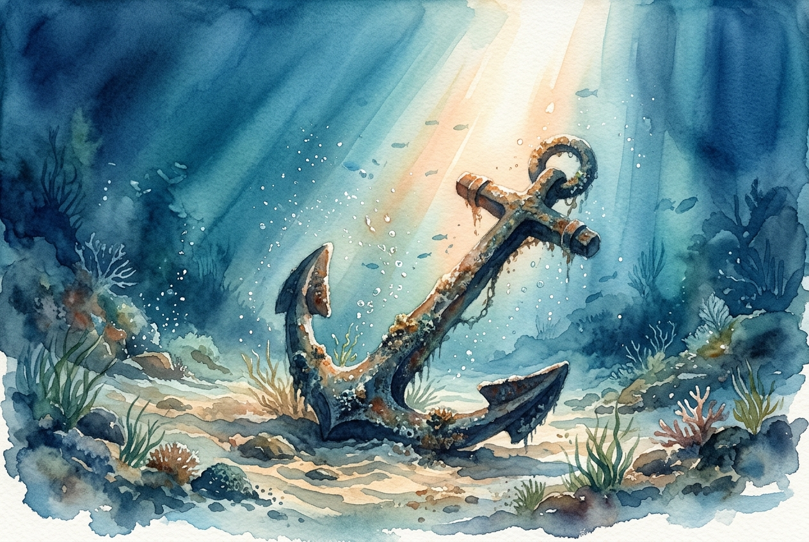

# Leitura Diária: Romans 8:31-39

*21 de junho de 2026*

> *(Image: A heavy iron anchor resting peacefully on the ocean floor, illuminated by a single warm shaft of sunlight piercing through deep blue water.)*

## A Leitura (PT-NVI)

**Romans 8:31-39**

> 31 Que diremos, pois, diante dessas coisas? Se Deus é por nós, quem será contra nós? 32 Aquele que não poupou a seu próprio Filho, mas o entregou por todos nós, como não nos dará juntamente com ele, e de graça, todas as coisas? 33 Quem fará alguma acusação contra os escolhidos de Deus? É Deus quem os justifica. 34 Quem os condenará? Foi Cristo Jesus que morreu; e mais, que ressuscitou e está à direita de Deus, e também intercede por nós. 35 Quem nos separará do amor de Cristo? Será tribulação, ou angústia, ou perseguição, ou fome, ou nudez, ou perigo, ou espada? 36 Como está escrito: "Por amor de ti enfrentamos a morte todos os dias; somos considerados como ovelhas destinadas ao matadouro". 37 Mas, em todas estas coisas somos mais que vencedores, por meio daquele que nos amou. 38 Pois estou convencido de que nem morte nem vida, nem anjos nem demônios, nem o presente nem o futuro, nem quaisquer poderes, 39 nem altura nem profundidade, nem qualquer outra coisa na criação será capaz de nos separar do amor de Deus que está em Cristo Jesus, nosso Senhor.

## A História

Paulo escrevia para uma comunidade em Roma que sabia perfeitamente o que significava se sentir vulnerável. A igreja primitiva vivia sob a sombra constante da suspeita política, da dificuldade econômica e da ameaça muito real de violência física. Nesta carta, ele aborda um medo profundo e universal: a ansiedade de que o sofrimento possa ser um sinal de abandono divino. Ele constrói uma cena de tribunal onde todas as acusações fracassam porque o juiz já está do lado do réu. Em seguida, ele amplia a visão para uma escala cósmica, listando todas as forças concebíveis no universo. Sua conclusão é uma rejeição ampla e definitiva da ideia de que algo poderia romper o vínculo entre o Criador e a criatura.

## Aplicação para Hoje

É incrivelmente fácil interpretar nossas dificuldades pessoais como evidência de que fomos esquecidos. Quando o diagnóstico é ruim, quando a conta bancária está vazia ou quando os relacionamentos se rompem, uma voz silenciosa muitas vezes sussurra que estamos por conta própria. No entanto, este texto insiste que nossas circunstâncias não são um termômetro confiável para o afeto divino. O amor descrito aqui não é um sentimento frágil que se despedaça sob pressão, mas uma âncora resistente que se mantém firme nas profundezas mais escuras. Você não precisa conquistar essa segurança, e não pode perdê-la por acidente. O que quer que esteja surgindo em seu horizonte hoje, não tem o poder de separá-lo do amor que sustenta o universo.

---

*Citações bíblicas extraídas da Nova Versão Internacional (NVI), © 1993, 2000 por Biblica, Inc. Usado com permissão.*
