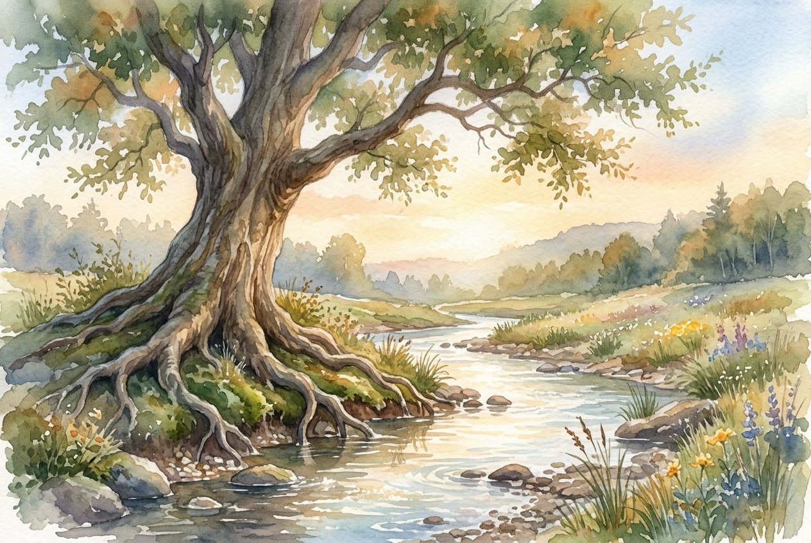

# Daily Reading: Psalm 1

*June 22, 2026*

> *(Image: A solitary ancient tree with deep roots growing beside a clear gently flowing stream in soft morning light.)*

## The Reading (NLT)

**Psalm 1**

> 1 Oh, the joys of those who do not follow the advice of the wicked, or stand around with sinners, or join in with mockers. 2 But they delight in the law of the Lord, meditating on it day and night. 3 They are like trees planted along the riverbank, bearing fruit each season. Their leaves never wither, and they prosper in all they do. 4 But not the wicked! They are like worthless chaff, scattered by the wind. 5 They will be condemned at the time of judgment. Sinners will have no place among the godly. 6 For the Lord watches over the path of the godly, but the path of the wicked leads to destruction.

## The Story

The book of Psalms opens not with a prayer or a hymn, but with a vivid contrast between two ways of living. Ancient Israel was an agrarian society where water meant survival, making the imagery of a well-watered plant instantly recognizable as a picture of enduring vitality. The psalmist sets up a stark division between a life rooted in divine wisdom and a life shaped by cynicism and passing trends. While one path offers deep nourishment and steady growth, the other is compared to the lightweight, discarded husks of grain blown away during the harvest. This opening song serves as a gateway to the entire psalter, inviting the reader to choose the foundation upon which their life will be built.

## Application for Today

We are constantly bombarded by voices telling us how to live, what to value, and who to mock. It is easy to absorb the cynicism of our culture without even realizing it. Yet, true stability comes from deliberately anchoring our attention in the steady rhythms of divine wisdom. When we draw our nourishment from a source deeper than the daily news cycle or social media feeds, we develop resilience. We might still face dry seasons and harsh weather, but our core remains vital and capable of producing good things in due time. The invitation is to slow down, quiet the noise, and let our roots sink into the quiet, life-giving soil of God's presence.

---

*Scripture quotations are taken from the Holy Bible, New Living Translation, copyright © 1996, 2004, 2015 by Tyndale House Foundation. Used by permission of Tyndale House Publishers.*
