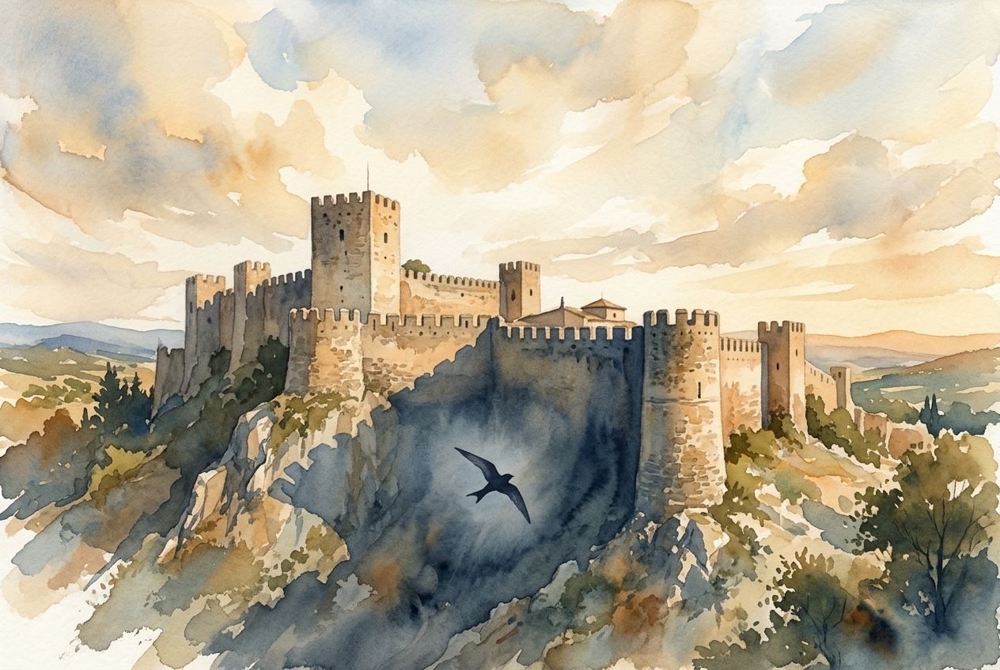

# Leitura Diária: Psalm 91

*22 de junho de 2026*

> *(Image: A massive ancient stone fortress standing peacefully under a sweeping sky, with a single bird gliding securely in the vast shadow cast by the high walls.)*

## A Leitura (PT-NVI)

**Psalm 91**

> 1 Aquele que habita no abrigo do Altíssimo e descansa à sombra do Todo-poderoso 2 pode dizer ao Senhor: Tu és o meu refúgio e a minha fortaleza, o meu Deus, em quem confio. 3 Ele o livrará do laço do caçador e do veneno mortal. 4 Ele o cobrirá com as suas penas, e sob as suas asas você encontrará refúgio; a fidelidade dele será o seu escudo protetor. 5 Você não temerá o pavor da noite, nem a flecha que voa de dia, 6 nem a peste que se move sorrateira nas trevas, nem a praga que devasta ao meio-dia. 7 Mil poderão cair ao seu lado, dez mil à sua direita, mas nada o atingirá. 8 Você simplesmente olhará, e verá o castigo dos ímpios. 9 Se você fizer do Altíssimo o seu refúgio, 10 nenhum mal o atingirá, desgraça alguma chegará à sua tenda. 11 Porque a seus anjos ele dará ordens a seu respeito, para que o protejam em todos os seus caminhos; 12 com as mãos eles o segurarão, para que você não tropece em alguma pedra. 13 Você pisará o leão e a cobra; pisoteará o leão forte e a serpente. 14 "Porque ele me ama, eu o resgatarei; eu o protegerei, pois conhece o meu nome. 15 Ele clamará a mim, e eu lhe darei resposta, e na adversidade estarei com ele; vou livrá-lo e cobri-lo de honra. 16 Vida longa eu lhe darei, e lhe mostrarei a minha salvação. "

## A História

O mundo antigo era repleto de perigos imprevisíveis. Desde doenças repentinas e emboscadas noturnas até a ameaça real de predadores selvagens, a sobrevivência muitas vezes parecia fora do controle humano. Este salmo fala diretamente a essa vulnerabilidade profunda e universal. O texto utiliza a imagem íntima de um pássaro protegendo seus filhotes ao lado da linguagem imponente de fortalezas militares. O poeta entende que o medo é um companheiro constante na vida humana, quer ataque na calada da noite ou em pleno dia. No entanto, a passagem aponta para uma realidade maior do que essas ameaças, descrevendo um Criador que oferece uma presença protetora e duradoura em meio ao caos.

## Aplicação para Hoje

Ainda enfrentamos um mundo que pode parecer incrivelmente frágil. Embora nossas ansiedades modernas possam ser diferentes das flechas antigas ou de leões à solta, a rapidez de uma crise ou a lenta aproximação do pavor continuam as mesmas. Esta passagem nos convida a mudar nosso foco dos perigos imprevisíveis ao nosso redor para a presença constante acima de nós. Ela não promete uma vida totalmente livre de dificuldades, observando especificamente que o Divino está conosco no meio da adversidade. Em vez disso, oferece um profundo senso de estabilidade. Ao escolhermos descansar nessa sombra silenciosa, encontramos a resiliência necessária para enfrentar o que o dia trouxer sem sermos consumidos pelo medo.

---

*Citações bíblicas extraídas da Nova Versão Internacional (NVI), © 1993, 2000 por Biblica, Inc. Usado com permissão.*
