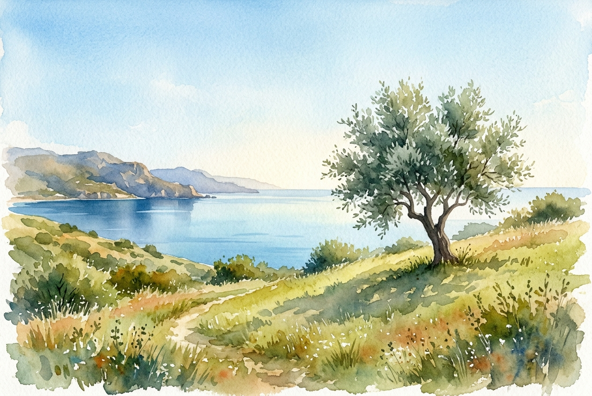

# Leitura Diária: Matthew 5:1-12

*23 de junho de 2026*

> *(Image: A serene sunlit grassy hillside with a single olive tree casting a soft shadow overlooking a calm body of water under a clear morning sky.)*

## A Leitura (PT-NVI)

**Matthew 5:1-12**

> 1 Vendo as multidões, Jesus subiu ao monte e se assentou. Seus discípulos aproximaram-se dele, 2 e ele começou a ensiná-los, dizendo: 3 "Bem-aventurados os pobres em espírito, pois deles é o Reino dos céus. 4 Bem-aventurados os que choram, pois serão consolados. 5 Bem-aventurados os humildes, pois eles receberão a terra por herança. 6 Bem-aventurados os que têm fome e sede de justiça, pois serão satisfeitos. 7 Bem-aventurados os misericordiosos, pois obterão misericórdia. 8 Bem-aventurados os puros de coração, pois verão a Deus. 9 Bem-aventurados os pacificadores, pois serão chamados filhos de Deus. 10 Bem-aventurados os perseguidos por causa da justiça, pois deles é o Reino dos céus. 11 "Bem-aventurados serão vocês quando, por minha causa os insultarem, perseguirem e levantarem todo tipo de calúnia contra vocês. 12 Alegrem-se e regozijem-se, porque grande é a recompensa de vocês nos céus, pois da mesma forma perseguiram os profetas que viveram antes de vocês".

## A História

Jesus reúne uma multidão em uma encosta para transmitir seu ensinamento mais famoso, abrindo com uma série de declarações surpreendentes. No mundo antigo, assim como hoje, o favor divino era frequentemente medido pela riqueza, pelo status e pelo conforto. Em vez disso, o mestre olha para os que estão com o coração partido, os esquecidos e os comprometidos com a reconciliação, declarando-os os verdadeiros herdeiros do reino prometido. Ele inverte completamente a sabedoria convencional de sua época, mudando o foco do sucesso externo para uma postura de dependência espiritual. A realidade que ele descreve não pertence aos conquistadores, mas aos compassivos.

## Aplicação para Hoje

É fácil presumir que nossas lutas pessoais ou épocas de luto significam que fomos de alguma forma abandonados. Quando experimentamos uma tristeza profunda, ansiamos que um mundo fraturado seja consertado, ou enfrentamos hostilidade por vivermos com integridade, muitas vezes nos sentimos tudo, menos afortunados. No entanto, essa mensagem na montanha nos convida a ver nossos momentos de profunda vulnerabilidade como os exatos lugares onde o consolo divino está mais presente. Escolher um espírito manso e trabalhar ativamente pela reconciliação não são sinais de fraqueza, mas marcas de uma resiliência espiritual duradoura. Mesmo em nossos momentos mais difíceis, somos vistos, amparados e profundamente valorizados.

---

*Citações bíblicas extraídas da Nova Versão Internacional (NVI), © 1993, 2000 por Biblica, Inc. Usado com permissão.*
