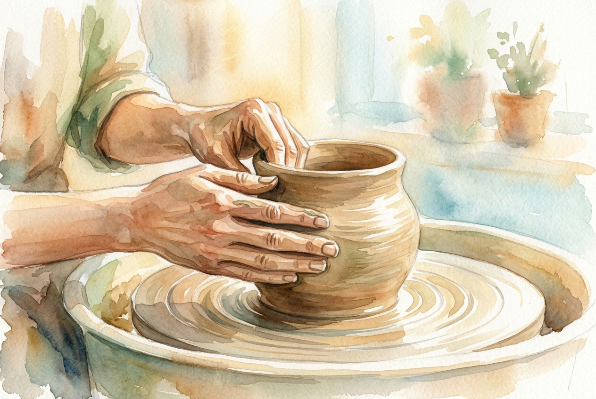

# Leitura Diária: Romans 12:1-2

*24 de junho de 2026*

> *(Image: A close-up of a potter's hands gently shaping a spinning vessel of raw clay illuminated by warm morning sunlight.)*

## A Leitura (PT-NVI)

**Romans 12:1-2**

> 1 Portanto, irmãos, rogo-lhes pelas misericórdias de Deus que se ofereçam em sacrifício vivo, santo e agradável a Deus; este é o culto racional de vocês. 2 Não se amoldem ao padrão deste mundo, mas transformem-se pela renovação da sua mente, para que sejam capazes de experimentar e comprovar a boa, agradável e perfeita vontade de Deus.

## A História

No antigo mundo mediterrâneo, a adoração estava quase sempre associada ao altar e ao derramamento de sangue. Os sacrifícios eram ofertas sem vida levadas a um templo para apaziguar o divino. Paulo introduz uma mudança radical para os primeiros cristãos em Roma ao descrever uma oferta que está viva e pulsante. Ele tira o centro da adoração de um edifício físico e o coloca diretamente nas ações cotidianas do corpo humano. Além disso, ele reconhece a intensa pressão do Império Romano, uma cultura construída sobre poder, status e dominação. Em vez de serem esmagados por esse molde imperial, ele convida a comunidade a uma completa renovação de suas vidas interiores.

## Aplicação para Hoje

Nossa cultura moderna tem seus próprios moldes implacáveis, constantemente nos empurrando para a exaustão, a comparação e a busca por status. É incrivelmente fácil absorver as ansiedades e prioridades do mundo ao nosso redor sem sequer perceber. O convite aqui é fazer uma pausa e permitir que nossas mentes sejam reconfiguradas pela graça. Isso significa oferecer nossas rotinas comuns e diárias como um ato de devoção, em vez de esperar por um evento espiritual espetacular. Quando mudamos nosso foco de tentar nos encaixar na multidão para buscar uma transformação profunda, nossa perspectiva começa a clarear. Começamos a reconhecer um modo de viver que é genuinamente bom, íntegro e profundamente satisfatório.

---

*Citações bíblicas extraídas da Nova Versão Internacional (NVI), © 1993, 2000 por Biblica, Inc. Usado com permissão.*
