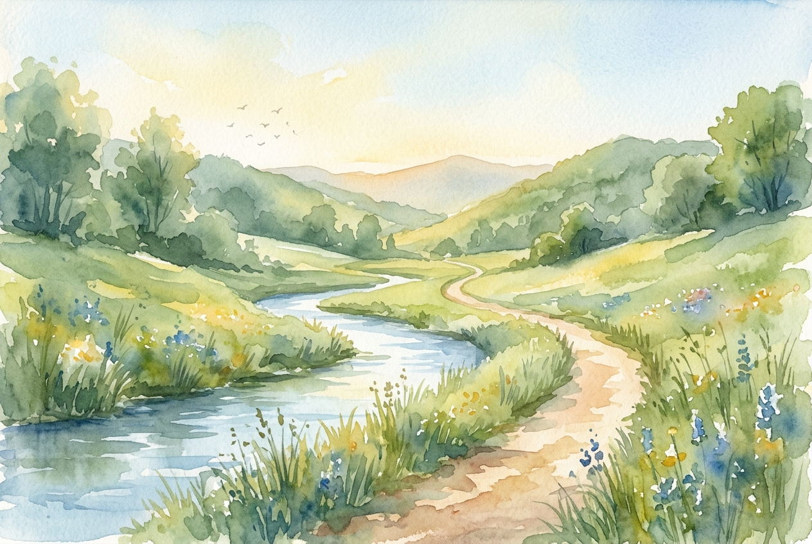

# Daily Reading: Psalm 23

*June 26, 2026*

> *(Image: A quiet sunlit path winding through a lush green valley beside a gentle clear stream.)*

## The Reading (NLT)

**Psalm 23**

> 1 The Lord is my shepherd; I have all that I need. 2 He lets me rest in green meadows; he leads me beside peaceful streams. 3 He renews my strength. He guides me along right paths, bringing honor to his name. 4 Even when I walk through the darkest valley, I will not be afraid, for you are close beside me. Your rod and your staff protect and comfort me. 5 You prepare a feast for me in the presence of my enemies. You honor me by anointing my head with oil. My cup overflows with blessings. 6 Surely your goodness and unfailing love will pursue me all the days of my life, and I will live in the house of the Lord forever.

## The Story

In ancient agrarian societies, the relationship between a shepherd and their flock was one of constant, intimate survival. Sheep are notoriously defenseless and easily frightened, requiring a guide who knows the terrain deeply. The writer of this ancient song draws on this familiar imagery to describe a Divine presence that provides profound security. This care involves not just physical sustenance, but active guidance away from danger and toward places of restoration. Even the tools of the trade, used to defend against predators and gently correct wandering steps, are seen as instruments of deep comfort. The imagery then shifts from a pasture to a royal banquet, showing a host who offers extravagant hospitality and protection even when hostility surrounds the guest.

## Application for Today

It is easy to feel entirely responsible for our own survival in a world that demands constant hustle and self-reliance. We often run ourselves ragged looking for a sense of safety and provision. Yet this ancient poetry invites us to picture ourselves under the care of a guide who already knows where the restful places are. We do not have to engineer every moment of peace or fight off every threat alone. When we encounter periods of deep grief or uncertainty, we can lean on the assurance that we are being closely accompanied. We can pause, breathe, and trust that goodness is actively pursuing us, offering a permanent place of belonging.

---

*Scripture quotations are taken from the Holy Bible, New Living Translation, copyright © 1996, 2004, 2015 by Tyndale House Foundation. Used by permission of Tyndale House Publishers.*
