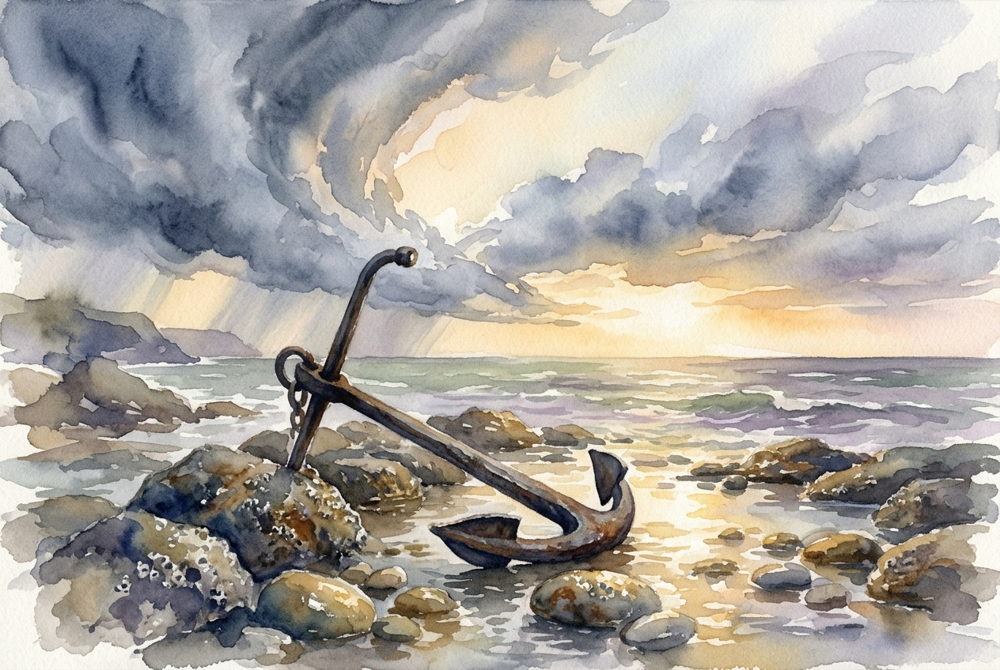

# Daily Reading: 1 Peter 5:6-11

*June 26, 2026*

> *(Image: A heavy iron anchor resting firmly on a rocky shoreline as dark storm clouds begin to part, revealing a warm, golden light illuminating the wet stone.)*

## The Reading (NLT)

**1 Peter 5:6-11**

> 6 So humble yourselves under the mighty power of God, and at the right time he will lift you up in honor. 7 Give all your worries and cares to God, for he cares about you. 8 Stay alert! Watch out for your great enemy, the devil. He prowls around like a roaring lion, looking for someone to devour. 9 Stand firm against him, and be strong in your faith. Remember that your family of believers all over the world is going through the same kind of suffering you are. 10 In his kindness God called you to share in his eternal glory by means of Christ Jesus. So after you have suffered a little while, he will restore, support, and strengthen you, and he will place you on a firm foundation. 11 All power to him forever! Amen.

## The Story

The early Christians receiving this letter were living under immense pressure. Scattered across Asia Minor, they faced social alienation and the constant threat of persecution for their faith. The author uses striking imagery to describe the hostility surrounding them, comparing their spiritual opposition to a predator on the hunt. Yet, the counsel given is not to fight back with worldly power, but to adopt a posture of profound vulnerability. They are instructed to release their anxieties entirely to God, trusting in a deep, abiding care that transcends their immediate circumstances. This letter frames their struggles not as isolated tragedies, but as a shared experience connecting them to believers everywhere.

## Application for Today

We often carry our anxieties as if we are the only ones strong enough to bear them. When faced with hostility, illness, or uncertainty, our instinct is usually to grip the reins of our lives even tighter. This passage invites us into a different way of living, one where true strength begins with letting go. Releasing our worries to God is an act of trust, acknowledging that we are held by someone far more capable than ourselves. Even when we feel hunted by our fears or worn down by hardship, we are reminded that our suffering is temporary and that we are not alone. Ultimately, the promise is that God himself will step in to rebuild, steady, and secure us on ground that cannot be shaken.

---

*Scripture quotations are taken from the Holy Bible, New Living Translation, copyright © 1996, 2004, 2015 by Tyndale House Foundation. Used by permission of Tyndale House Publishers.*
