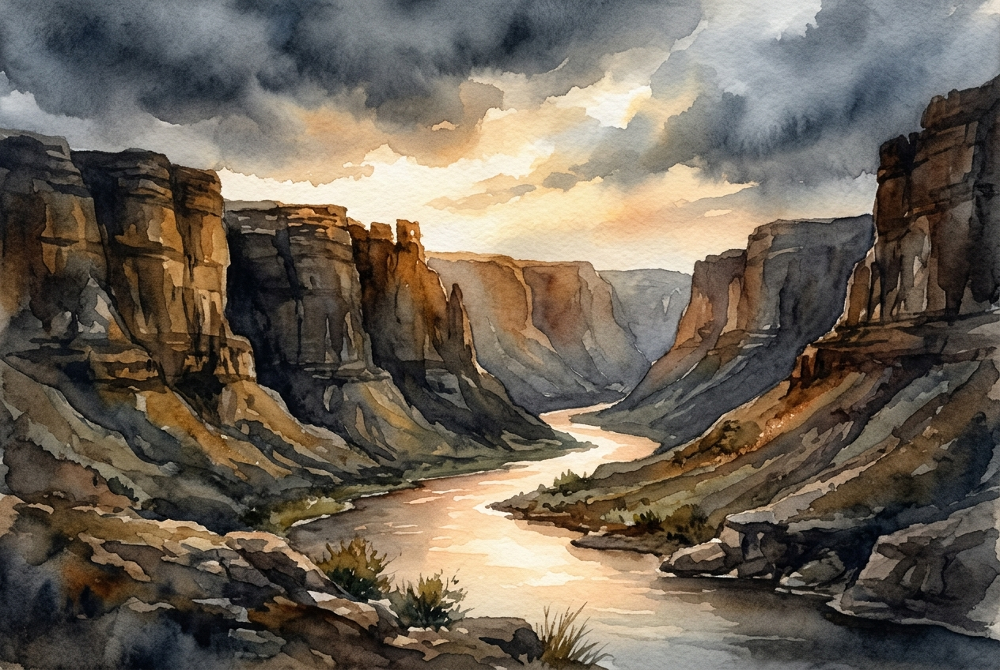

# Leitura Diária: Psalm 46

*27 de junho de 2026*

> *(Image: A gentle, glowing river flows peacefully through a deep, solid stone canyon, illuminated by soft morning light breaking through heavy, dark storm clouds above.)*

## A Leitura (PT-NVI)

**Psalm 46**

> 1 Deus é o nosso refúgio e a nossa fortaleza, auxílio sempre presente na adversidade. 2 Por isso não temeremos, embora a terra trema e os montes afundem no coração do mar, 3 embora estrondem as suas águas turbulentas e os montes sejam sacudidos pela sua fúria. Pausa 4 Há um rio cujos canais alegram a cidade de Deus, o Santo Lugar onde habita o Altíssimo. 5 Deus nela está! Não será abalada! Deus vem em seu auxílio desde o romper da manhã. 6 Nações se agitam, reinos se abalam; ele ergue a voz, e a terra se derrete. 7 O Senhor dos Exércitos está conosco; o Deus de Jacó é a nossa torre segura. Pausa 8 Venham! Vejam as obras do Senhor, seus feitos estarrecedores na terra. 9 Ele dá fim às guerras até os confins da terra; quebra o arco e despedaça a lança, destrói os escudos com fogo. 10 "Parem de lutar! Saibam que eu sou Deus! Serei exaltado entre as nações, serei exaltado na terra. " 11 O Senhor dos Exércitos está conosco; o Deus de Jacó é a nossa torre segura. Pausa

## A História

Os compositores antigos viviam em um mundo onde a segurança era medida pela espessura das muralhas e pelo tamanho dos exércitos. Quando ameaças geopolíticas surgiam ou desastres naturais atacavam, o instinto natural era o pânico ou a preparação frenética. No entanto, este cântico pinta um quadro radicalmente diferente de proteção. Ele contrasta o estrondo aterrorizante de montanhas desmoronando e nações em fúria com um rio suave e vivificante que flui através de uma cidade segura. A tática final de defesa apresentada aqui não é acumular armas ou construir fortificações mais altas, mas sim abandoná-las completamente. O texto imagina uma presença divina tão poderosa que desmonta os próprios instrumentos de guerra, convidando a uma parada súbita e profunda do esforço humano.

## Aplicação para Hoje

Ainda gastamos muita energia tentando construir muros intransponíveis ao redor de nossas vidas, carreiras e famílias. Quando nossos mundos pessoais parecem estar tremendo, a reação padrão costuma ser trabalhar mais, nos preocupar mais e tentar controlar os resultados. Mas a sabedoria milenar deste texto nos convida a uma postura contraintuitiva. Em vez de igualar o caos das circunstâncias com nossa própria agitação interna, somos chamados a parar. Baixar nossas defesas e a necessidade de gerenciar cada crise nos permite reconhecer uma presença firme e inabalável por baixo de todo o ruído. O verdadeiro refúgio não é a ausência de problemas, mas a certeza silenciosa de que somos amparados por uma força muito maior que a nossa.

---

*Citações bíblicas extraídas da Nova Versão Internacional (NVI), © 1993, 2000 por Biblica, Inc. Usado com permissão.*
