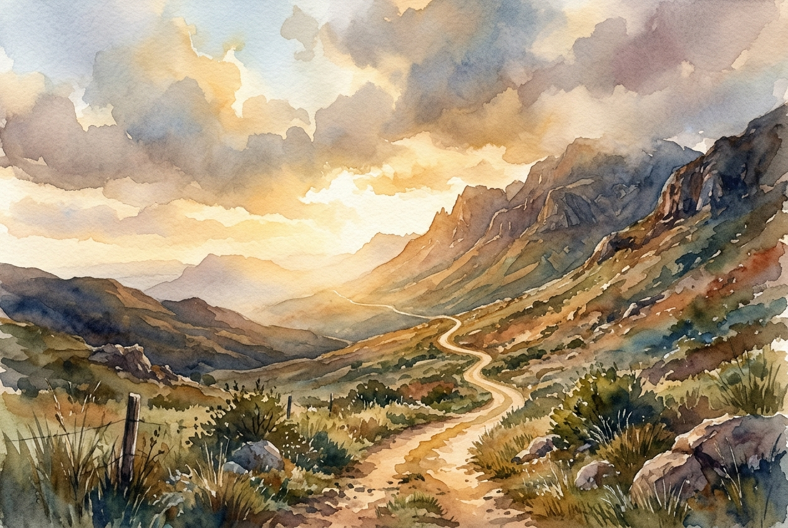

# Daily Reading: Psalm 121

*June 28, 2026*

> *(Image: A solitary winding dirt path leading up a rugged mountain side illuminated by the soft golden light of dawn breaking through heavy clouds.)*

## The Reading (NLT)

**Psalm 121**

> 1 I look up to the mountainsdoes my help come from there? 2 My help comes from the Lord, who made heaven and earth! 3 He will not let you stumble; the one who watches over you will not slumber. 4 Indeed, he who watches over Israel never slumbers or sleeps. 5 The Lord himself watches over you! The Lord stands beside you as your protective shade. 6 The sun will not harm you by day, nor the moon at night. 7 The Lord keeps you from all harm and watches over your life. 8 The Lord keeps watch over you as you come and go, both now and forever.

## The Story

Ancient pilgrims sang this song as they traveled the treacherous uphill roads toward Jerusalem. The journey was fraught with real dangers, from steep cliffs and harsh weather to bandits hiding in the rocky passes. When a traveler looked up at the looming mountains, they might feel a deep sense of vulnerability and isolation. Yet, this song shifts the traveler's gaze past the threatening landscape to the one who formed it. The psalmist reminds the community that their safety doesn't depend on their own vigilance, but on a Creator who never rests. It is a communal reassurance that the maker of the cosmos is intimately attentive to their every step.

## Application for Today

We still navigate landscapes that feel overwhelming and full of hidden threats. It is easy to stare at the obstacles towering in front of us and wonder how we will survive the climb. This ancient wisdom invites us to lift our perspective higher than the immediate struggles we face. We are invited to trust that we are held by a tireless guardian who walks beside us in the scorching heat and the disorienting dark. You do not have to carry the burden of constant hyper-vigilance. Rest in the quiet assurance that your comings and goings are watched over by a love that never sleeps.

---

*Scripture quotations are taken from the Holy Bible, New Living Translation, copyright © 1996, 2004, 2015 by Tyndale House Foundation. Used by permission of Tyndale House Publishers.*
