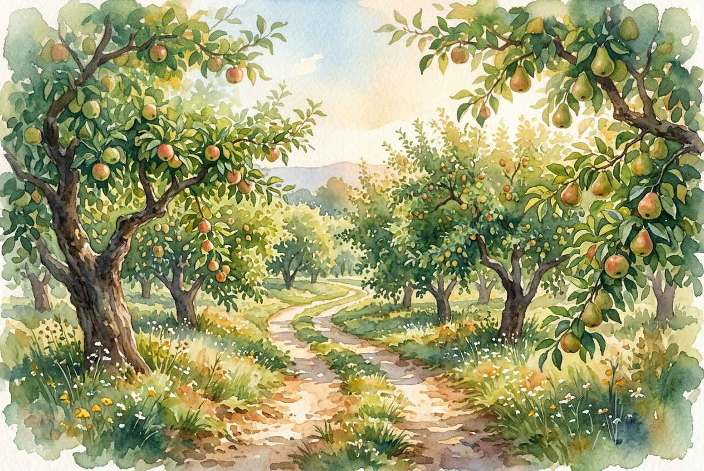

# Daily Reading: Galatians 5:22-26

*June 28, 2026*

> *(Image: A sunlit dirt path winding through a lush green orchard with heavy branches, completely empty of people, bathed in soft morning light.)*

## The Reading (NLT)

**Galatians 5:22-26**

> 22 But the Holy Spirit produces this kind of fruit in our lives: love, joy, peace, patience, kindness, goodness, faithfulness, 23 gentleness, and self-control. There is no law against these things! 24 Those who belong to Christ Jesus have nailed the passions and desires of their sinful nature to his cross and crucified them there. 25 Since we are living by the Spirit, let us follow the Spirit's leading in every part of our lives. 26 Let us not become conceited, or provoke one another, or be jealous of one another.

## The Story

When Paul wrote to the early churches, he often used the metaphor of walking to describe a life of faith. In this letter, he contrasts two very different ways to travel through life. One path is driven by our base instincts, leading to competition, envy, and conflict with those around us. The alternative is a journey guided entirely by the Divine presence. Rather than a forced march under strict regulations, Paul describes a natural, organic growth that happens when we align our steps with the Creator. It is a slow, steady harvest of character that transforms how we treat our fellow travelers.

## Application for Today

Navigating life's difficult stretches often brings out our most defensive instincts. We might feel the urge to push ahead of others, harbor jealousy, or react with sharp words when the road gets steep. Yet, we are invited to travel at a different pace. Yielding to the Divine presence means allowing our rough edges to be left behind, making room for a quiet strength to grow within us. As we take each step today, we can choose to walk with patience and gentleness. By focusing on our own steady progress rather than competing with others, we cultivate a deep, enduring peace for the journey.

---

*Scripture quotations are taken from the Holy Bible, New Living Translation, copyright © 1996, 2004, 2015 by Tyndale House Foundation. Used by permission of Tyndale House Publishers.*
