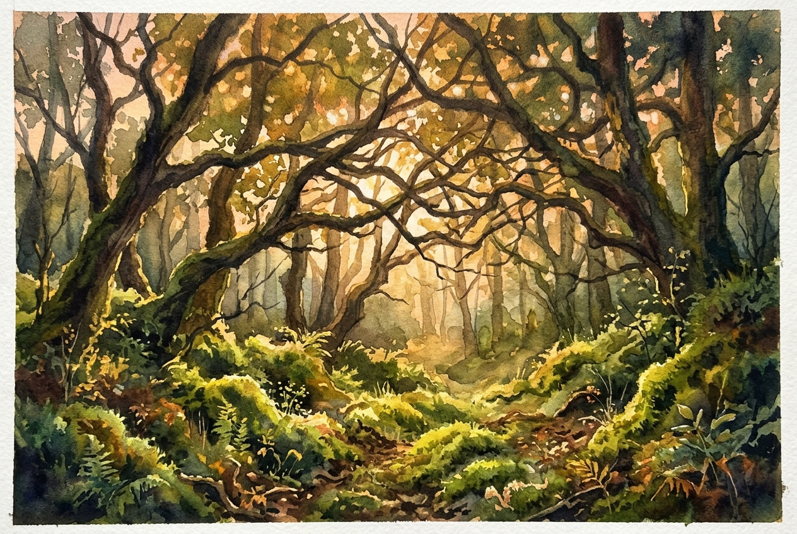

# Daily Reading: 1 John 4:7-16

*June 29, 2026*

> *(Image: A warm, golden light filtering through the intertwined branches of ancient trees in a dense forest, illuminating the vibrant green moss on the ground.)*

## The Reading (NLT)

**1 John 4:7-16**

> 7 Dear friends, let us continue to love one another, for love comes from God. Anyone who loves is a child of God and knows God. 8 But anyone who does not love does not know God, for God is love. 9 God showed how much he loved us by sending his one and only Son into the world so that we might have eternal life through him. 10 This is real love not that we loved God, but that he loved us and sent his Son as a sacrifice to take away our sins. 11 Dear friends, since God loved us that much, we surely ought to love each other. 12 No one has ever seen God. But if we love each other, God lives in us, and his love is brought to full expression in us. 13 And God has given us his Spirit as proof that we live in him and he in us. 14 Furthermore, we have seen with our own eyes and now testify that the Father sent his Son to be the Savior of the world. 15 All who declare that Jesus is the Son of God have God living in them, and they live in God. 16 We know how much God loves us, and we have put our trust in his love. God is love, and all who live in love live in God, and God lives in them.

## The Story

The early Christian communities were navigating deep fractures and theological disputes. In his letter to these divided believers, John offers a profound reorientation. He strips away complex arguments to reveal the foundational truth of their faith. The author insists that the divine nature is not merely characterized by affection, but is entirely defined by it. Because the Creator remains invisible to human eyes, the early church needed a tangible way to demonstrate his reality to the surrounding world. John argues that this ultimate evidence is found in the way members of the community treat each other. Their mutual care becomes the very space where the divine presence dwells and is made complete.

## Application for Today

It is easy to treat faith as an intellectual exercise or a private spiritual experience. Yet this passage challenges us to see our daily interactions as the primary arena where the divine becomes visible. When we choose patience over frustration or extend grace in moments of conflict, we are doing more than just being kind. We are actually allowing the invisible reality of the Creator to take physical shape in our neighborhoods and workplaces. The pressure to prove our beliefs through argument fades away. Instead, our simple, consistent acts of care become the most compelling evidence of what we believe. Love is not just something we do, but the environment where we meet the divine.

---

*Scripture quotations are taken from the Holy Bible, New Living Translation, copyright © 1996, 2004, 2015 by Tyndale House Foundation. Used by permission of Tyndale House Publishers.*
