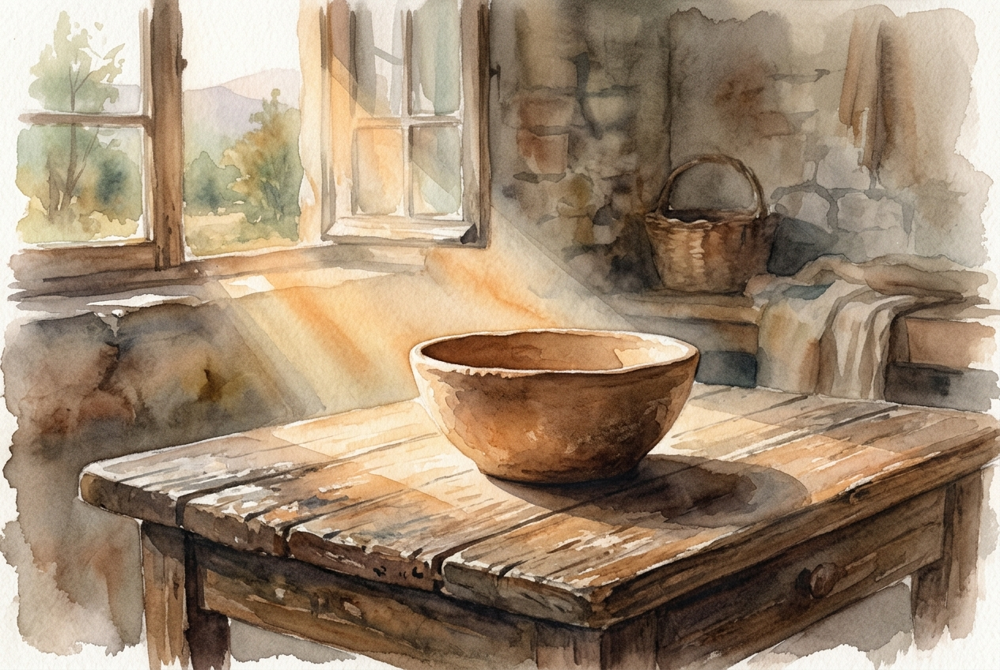

# Daily Reading: Romans 12:1-2

*June 29, 2026*

> *(Image: A single shaft of warm morning light illuminating a simple unadorned clay bowl resting on a weathered wooden table.)*

## The Reading (NLT)

**Romans 12:1-2**

> 1 And so, dear brothers and sisters, I plead with you to give your bodies to God because of all he has done for you. Let them be a living and holy sacrifice the kind he will find acceptable. This is truly the way to worship him. 2 Don't copy the behavior and customs of this world, but let God transform you into a new person by changing the way you think. Then you will learn to know God's will for you, which is good and pleasing and perfect.

## The Story

Paul reaches a turning point in his letter to the church in Rome. After spending chapters outlining the vast and sweeping nature of divine mercy, he brings the focus down to the gritty reality of daily life. In the ancient world, worship almost always involved bringing an animal to an altar. Paul flips this deeply ingrained expectation entirely. He suggests that the ultimate response to divine grace is not an external ritual, but the offering of one's own ordinary and breathing life.

## Application for Today

It is tempting to compartmentalize faith by keeping it safely contained within specific buildings or designated hours. Yet the invitation here is far more encompassing and disruptive. We are asked to let our regular routines, our physical presence, and our deeply held assumptions be completely reshaped. This kind of transformation does not happen by simply trying harder to follow rules, but by allowing our perspective to be continually renewed. When we stop mimicking the anxious and self-serving patterns around us, our daily existence itself becomes the most profound act of reverence we can offer.

---

*Scripture quotations are taken from the Holy Bible, New Living Translation, copyright © 1996, 2004, 2015 by Tyndale House Foundation. Used by permission of Tyndale House Publishers.*
