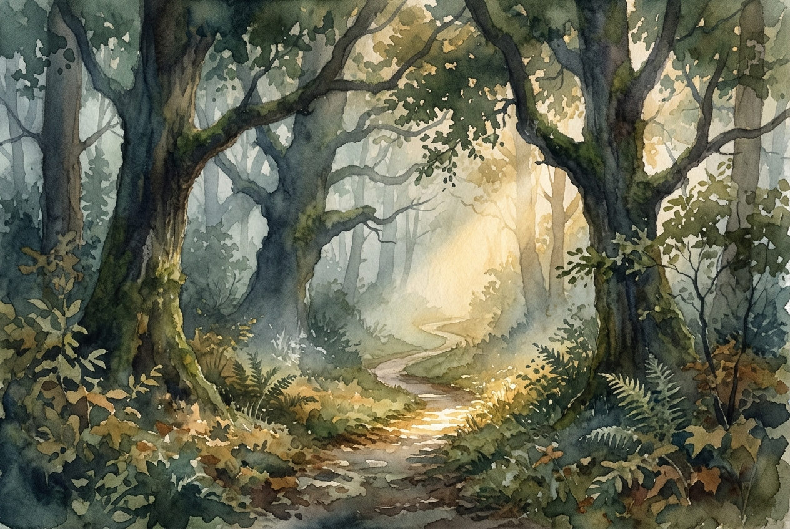

# Daily Reading: Proverbs 3:5-8

*June 30, 2026*

> *(Image: A tranquil misty path winding through a dense ancient forest, with warm golden light breaking through the canopy to illuminate the next few steps.)*

## The Reading (NLT)

**Proverbs 3:5-8**

> 5 Trust in the Lord with all your heart; do not depend on your own understanding. 6 Seek his will in all you do, and he will show you which path to take. 7 Don't be impressed with your own wisdom. Instead, fear the Lord and turn away from evil. 8 Then you will have healing for your body and strength for your bones.

## The Story

Ancient wisdom literature often frames life as a journey along a physical path. In the cultural context of the ancient Near East, travelers relied heavily on established roads, local guides, and their own wits to navigate treacherous terrain. The writer of this proverb addresses a common human tendency: the desire to map out our own lives using only our limited vantage point. Wisdom, in this tradition, is not merely intellectual knowledge or cleverness. It is a posture of humility that recognizes the vast difference between our finite perception and the Creator's panoramic view. By choosing to release our tight grip on our own strategies, we open ourselves to a more reliable guide.

## Application for Today

We spend so much of our lives trying to figure everything out. We build elaborate plans, anticipate every possible obstacle, and rely on our own intellect to secure our futures. But true peace begins when we admit that our perspective is incomplete. Surrendering our need for total control is not a sign of weakness; it is an intentional choice to lean on a wisdom far deeper than our own. When we bring our decisions, anxieties, and daily steps to God, the burden of having to know it all lifts. This shift from self-reliance to quiet trust brings a profound sense of wellness, settling our minds and restoring our weary spirits.

---

*Scripture quotations are taken from the Holy Bible, New Living Translation, copyright © 1996, 2004, 2015 by Tyndale House Foundation. Used by permission of Tyndale House Publishers.*
