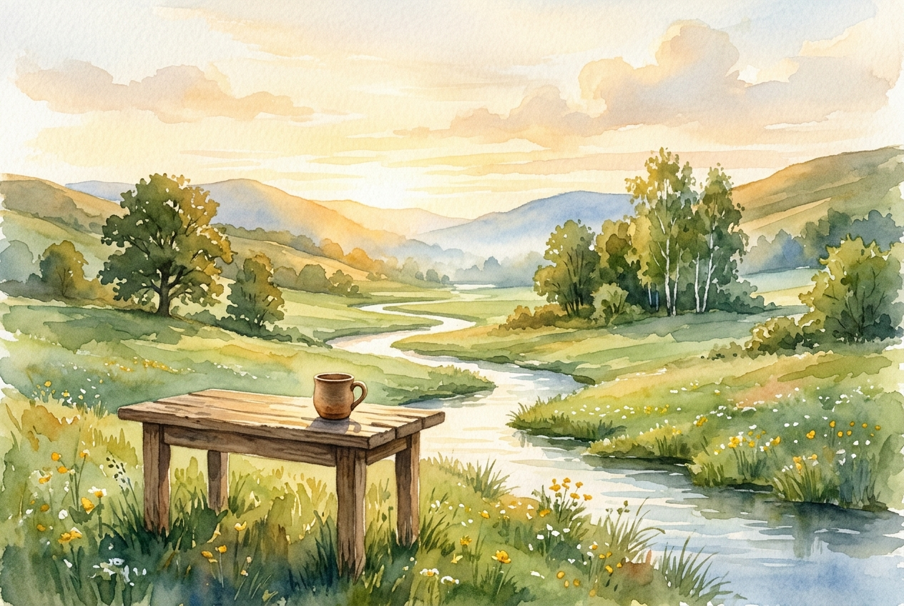

# Daily Reading: Psalm 23

*July 1, 2026*

> *(Image: A serene landscape painting of a quiet stream winding through a lush green valley as the morning sun casts a warm, golden glow over a simple wooden table set with a single clay cup.)*

## The Reading (NLT)

**Psalm 23**

> 1 The Lord is my shepherd; I have all that I need. 2 He lets me rest in green meadows; he leads me beside peaceful streams. 3 He renews my strength. He guides me along right paths, bringing honor to his name. 4 Even when I walk through the darkest valley, I will not be afraid, for you are close beside me. Your rod and your staff protect and comfort me. 5 You prepare a feast for me in the presence of my enemies. You honor me by anointing my head with oil. My cup overflows with blessings. 6 Surely your goodness and unfailing love will pursue me all the days of my life, and I will live in the house of the Lord forever.

## The Story

Ancient Judea was a rugged, arid landscape where survival depended on knowing where to find hidden springs and safe pastures. A good shepherd intimately knew the terrain, anticipating dangers and guiding the flock away from steep cliffs. The imagery shifts halfway through from a shepherd in the field to a generous host in a tent. In ancient Near Eastern culture, welcoming someone to your table meant offering them absolute protection and honor, even if adversaries were waiting right outside. The anointing oil and overflowing cup were signs of lavish hospitality, signaling to the guest that they were deeply valued and entirely safe.

## Application for Today

We often spend our days running from one obligation to the next, convinced that our survival rests entirely on our own shoulders. This ancient song invites us to release that exhausting illusion of control. We are invited to trust that we are being led by a guide who knows the landscape of our lives better than we do. When the path dips into shadows or when hostility surrounds us, the promise is not that the danger will instantly vanish, but that we will not face it alone. There is a profound peace in recognizing that we are cared for, protected, and offered a seat at a table where grace is already poured out.

---

*Scripture quotations are taken from the Holy Bible, New Living Translation, copyright © 1996, 2004, 2015 by Tyndale House Foundation. Used by permission of Tyndale House Publishers.*
