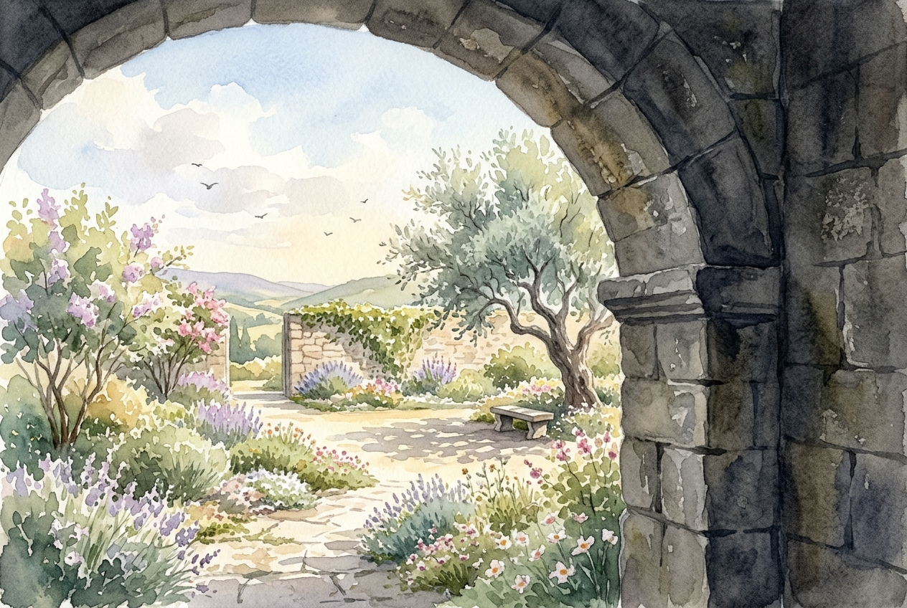

# Leitura Diária: Philippians 4:4-9

*1 de julho de 2026*

> *(Image: A serene, sunlit garden viewed through the heavy stone archway of an ancient fortress, illustrating a contrast between immovable strength and quiet tranquility.)*

## A Leitura (PT-NVI)

**Philippians 4:4-9**

> 4 Alegrem-se sempre no Senhor. Novamente direi: alegrem-se! 5 Seja a amabilidade de vocês conhecida por todos. Perto está o Senhor. 6 Não andem ansiosos por coisa alguma, mas em tudo, pela oração e súplicas, e com ação de graças, apresentem seus pedidos a Deus. 7 E a paz de Deus, que excede todo o entendimento, guardará os seus corações e as suas mentes em Cristo Jesus. 8 Finalmente, irmãos, tudo o que for verdadeiro, tudo o que for nobre, tudo o que for correto, tudo o que for puro, tudo o que for amável, tudo o que for de boa fama, se houver algo de excelente ou digno de louvor, pensem nessas coisas. 9 Tudo o que vocês aprenderam, receberam, ouviram e viram em mim, ponham-no em prática. E o Deus da paz estará com vocês.

## A História

O autor escreveu esta carta a uma comunidade muito amada enquanto, muito provavelmente, enfrentava a prisão romana. Suas circunstâncias eram precárias, marcadas pela incerteza sobre sua própria sobrevivência. Ainda assim, a correspondência transborda de temas de contentamento e resiliência mental. Ele orienta seus amigos para uma disciplina espiritual específica, que desvia o foco das ameaças imediatas para uma bondade duradoura. Sabendo que a ansiedade frequentemente constrói uma prisão interna, ele oferece um projeto para desmontá-la. Ele descreve uma tranquilidade divina que atua como um sentinela militar, montando guarda sobre a vida interior deles.

## Aplicação para Hoje

Frequentemente nos vemos navegando por cenários de preocupação, com nossos pensamentos correndo em direção aos piores desfechos. O convite aqui não é fingir que nossos problemas não existem, mas direcionar nossa atenção intencionalmente. Ao levarmos nossos medos a Deus acompanhados de gratidão, abrimos espaço para que uma calma inexplicável se instale. Essa prática exige escolher onde deixamos nossa mente habitar, ancorando nossos pensamentos naquilo que é belo, verdadeiro e que traz vida. Quando curamos nosso foco dessa maneira, cultivamos um santuário interno. Descobrimos uma segurança profunda que nos mantém firmes, mesmo quando o mundo ao nosso redor parece caótico.

---

*Citações bíblicas extraídas da Nova Versão Internacional (NVI), © 1993, 2000 por Biblica, Inc. Usado com permissão.*
