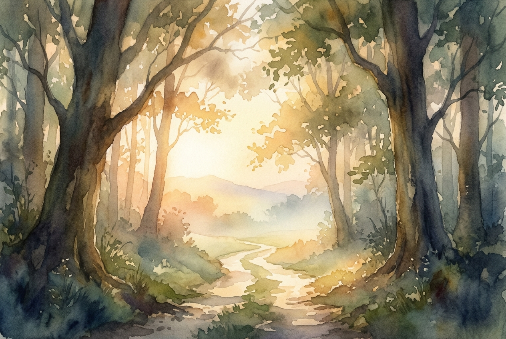

# Daily Reading: John 3:16-21

*July 2, 2026*

> *(Image: A soft, golden sunrise breaking through a dense, misty forest, illuminating a clear path forward while gentle shadows recede.)*

## The Reading (NLT)

**John 3:16-21**

> 16 For this is how God loved the world: He gave his one and only Son, so that everyone who believes in him will not perish but have eternal life. 17 God sent his Son into the world not to judge the world, but to save the world through him. 18 There is no judgment against anyone who believes in him. But anyone who does not believe in him has already been judged for not believing in God's one and only Son. 19 And the judgment is based on this fact: God's light came into the world, but people loved the darkness more than the light, for their actions were evil. 20 All who do evil hate the light and refuse to go near it for fear their sins will be exposed. 21 But those who do what is right come to the light so others can see that they are doing what God wants.

## The Story

When a religious leader visits under the cover of night, the conversation naturally turns to the contrast between darkness and illumination. In the ancient world, night was a time of vulnerability and hiddenness, a fitting backdrop for someone seeking answers he could not ask in the daytime. The dialogue reveals a profound shift in how the divine interacts with humanity. Instead of a cosmic judge waiting to catch people in their failures, the divine posture is revealed as an overwhelming, rescuing love. The arrival of the chosen one is framed not as an investigative mission to condemn, but as a rescue operation. The darkness is simply the human instinct to hide our brokenness out of fear of exposure.

## Application for Today

We often carry an underlying fear that if we are truly seen, we will be rejected. This makes the instinct to hide our flaws deeply ingrained, pulling us toward the shadows where our struggles remain our own private burden. Yet the invitation here is to reframe how we view divine illumination. The light is not a harsh spotlight meant to shame us, but a healing dawn designed to guide us out of isolation. When we understand that the ultimate goal is our rescue and not our ruin, stepping out of hiding becomes a safe choice. Embracing honesty about who we are allows us to experience a love that meets us exactly where we stand.

---

*Scripture quotations are taken from the Holy Bible, New Living Translation, copyright © 1996, 2004, 2015 by Tyndale House Foundation. Used by permission of Tyndale House Publishers.*
