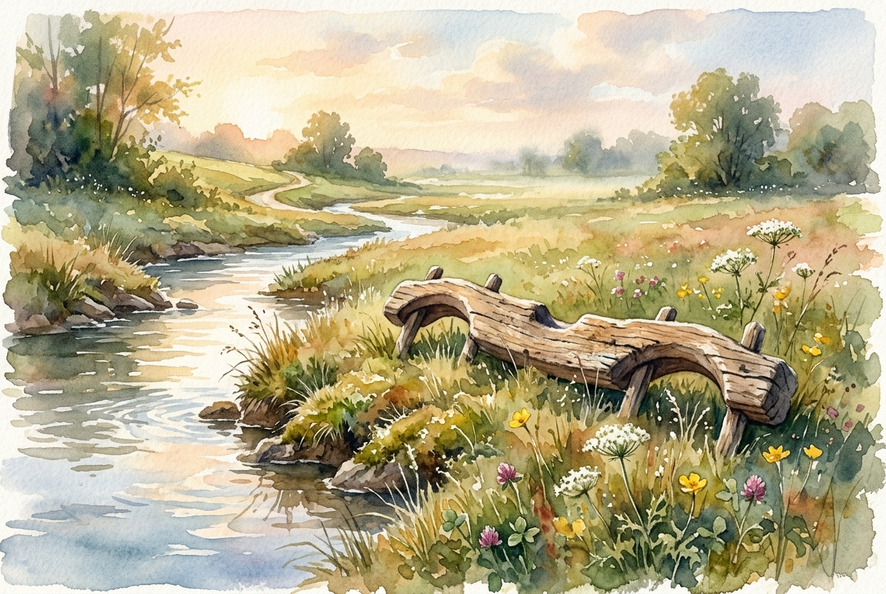

# Daily Reading: Matthew 11:28-30

*July 3, 2026*

> *(Image: A weathered, hand-carved wooden yoke resting peacefully in a sunlit, grassy field beside a gently flowing stream.)*

## The Reading (NLT)

**Matthew 11:28-30**

> 28 Then Jesus said, Come to me, all of you who are weary and carry heavy burdens, and I will give you rest. 29 Take my yoke upon you. Let me teach you, because I am humble and gentle at heart, and you will find rest for your souls. 30 For my yoke is easy to bear, and the burden I give you is light.

## The Story

In the ancient agrarian world, a yoke was a heavy wooden beam crafted to fit across the shoulders of oxen, allowing them to pull a plow together. Religious leaders of the first century often used this imagery to describe submission to divine law. However, the everyday people listening to this teaching were utterly exhausted. They were crushed under the dual weights of Roman taxation and complex religious regulations that left them feeling constantly inadequate. The invitation offered here flips the script on what devotion looks like. Instead of a rigid system of endless demands, the teacher presents himself as a gentle guide offering a way of life that actually fits the human soul.

## Application for Today

We still live in a world that praises exhaustion and piles on expectations. We carry the crushing weights of career demands, social obligations, and even our own harsh inner critics. Often, we treat our spiritual lives as just one more heavy task to manage, one more area where we might be falling short. But the invitation remains radically different from the demands of our culture. We are not promised a life free of effort or responsibility, as a yoke is still a tool meant for work. Instead, we are offered a partnership that brings deep, sustainable peace. When we align our daily pace with the gentle rhythms of grace, the burdens we carry no longer break us, but become a shared load.

---

*Scripture quotations are taken from the Holy Bible, New Living Translation, copyright © 1996, 2004, 2015 by Tyndale House Foundation. Used by permission of Tyndale House Publishers.*
