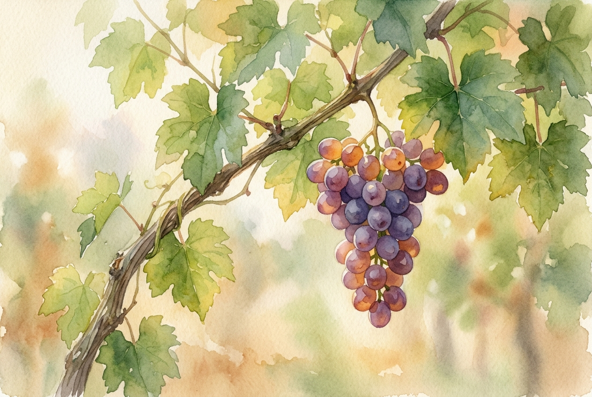

# Leitura Diária: Galatians 5:22-26

*4 de julho de 2026*

> *(Image: A close-up of a thriving, green vine with a single, ripe cluster of fruit hanging in warm morning sunlight.)*

## A Leitura (PT-NVI)

**Galatians 5:22-26**

> 22 Mas o fruto do Espírito é amor, alegria, paz, paciência, amabilidade, bondade, fidelidade, 23 mansidão e domínio próprio. Contra essas coisas não há lei. 24 Os que pertencem a Cristo Jesus crucificaram a carne, com as suas paixões e os seus desejos. 25 Se vivemos pelo Espírito, andemos também pelo Espírito. 26 Não sejamos presunçosos, provocando uns aos outros e tendo inveja uns dos outros.

## A História

Quando Paulo escreveu às primeiras comunidades na Galácia, elas estavam imersas em debates intensos sobre regras, comportamentos e quem realmente pertencia ao grupo. As pessoas estavam exaustas de viver a fé como se fosse uma lista de tarefas, tentando controlar os próprios impulsos através de regulamentos rígidos. Em resposta, o apóstolo muda completamente a metáfora, passando de um tribunal para um pomar. Ele descreve um crescimento orgânico que acontece quando a vida de uma pessoa está enraizada na presença divina. Em vez de fabricar um bom comportamento através da força de vontade, essa transformação é apresentada como uma colheita que surge de forma lenta e natural. Os velhos padrões egocêntricos são deixados para trás, abrindo espaço para uma maneira totalmente nova de caminhar pelo mundo.

## Aplicação para Hoje

Muitas vezes tratamos nossa vida espiritual como um projeto de autoaperfeiçoamento, contabilizando nossos sucessos e fracassos diários. No entanto, o verdadeiro amadurecimento não acontece simplesmente porque nos esforçamos mais para ser pacientes ou amáveis. Ele ocorre quando permanecemos conectados à fonte de vida e permitimos que essa presença molde nossas reações. Ao abrirmos mão da necessidade de competir com os outros ou de provar nosso próprio valor, criamos espaço para que algo belo crie raízes. As qualidades que mais desejamos não são troféus a serem conquistados, mas o resultado natural de uma vida guiada por uma entrega serena. Hoje, em vez de se forçar a atingir a perfeição, concentre-se apenas em manter o coração aberto à orientação suave que está disponível a você neste exato momento.

---

*Citações bíblicas extraídas da Nova Versão Internacional (NVI), © 1993, 2000 por Biblica, Inc. Usado com permissão.*
