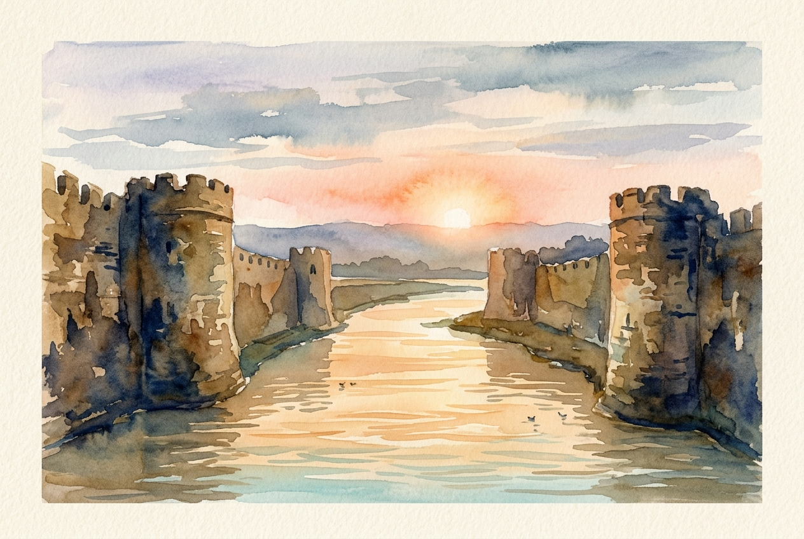

# Leitura Diária: Psalm 46

*4 de julho de 2026*

> *(Image: A calm, glowing river flowing gently through the center of a rugged, ancient stone fortress at dawn.)*

## A Leitura (PT-NVI)

**Psalm 46**

> 1 Deus é o nosso refúgio e a nossa fortaleza, auxílio sempre presente na adversidade. 2 Por isso não temeremos, embora a terra trema e os montes afundem no coração do mar, 3 embora estrondem as suas águas turbulentas e os montes sejam sacudidos pela sua fúria. Pausa 4 Há um rio cujos canais alegram a cidade de Deus, o Santo Lugar onde habita o Altíssimo. 5 Deus nela está! Não será abalada! Deus vem em seu auxílio desde o romper da manhã. 6 Nações se agitam, reinos se abalam; ele ergue a voz, e a terra se derrete. 7 O Senhor dos Exércitos está conosco; o Deus de Jacó é a nossa torre segura. Pausa 8 Venham! Vejam as obras do Senhor, seus feitos estarrecedores na terra. 9 Ele dá fim às guerras até os confins da terra; quebra o arco e despedaça a lança, destrói os escudos com fogo. 10 "Parem de lutar! Saibam que eu sou Deus! Serei exaltado entre as nações, serei exaltado na terra. " 11 O Senhor dos Exércitos está conosco; o Deus de Jacó é a nossa torre segura. Pausa

## A História

O salmista pinta um quadro de caos cósmico e político absoluto. Montanhas desabam no oceano, águas se agitam violentamente e nações inteiras entram em tumulto. No mundo antigo, o mar frequentemente simbolizava forças aterrorizantes e incontroláveis, enquanto as cidades fortificadas representavam a segurança humana. No entanto, a estabilidade descrita aqui não vem de muralhas mais grossas ou espadas mais afiadas. Em vez disso, ela flui de um rio silencioso e vivificante que sustenta a cidade por dentro. O clímax do poema é uma ordem divina para largar as armas de guerra e cessar a luta interminável. A verdadeira segurança é alcançada não pelo esforço humano, mas pelo reconhecimento da presença divina.

## Aplicação para Hoje

Muitas vezes respondemos ao caos de nossas próprias vidas lutando com mais força e tentando controlar todos os resultados. Quando nossos mundos pessoais parecem estar tremendo, nosso instinto é vestir a armadura e forçar uma solução. Contudo, o convite deste texto é completamente contraintuitivo para a nossa mentalidade moderna. Somos chamados a parar de lutar, a relaxar nosso controle rígido e a simplesmente reconhecer quem está no comando. Esse tipo de quietude não é uma rendição passiva ao desespero, mas uma confiança ativa em um alicerce seguro. Ao abrirmos mão da necessidade de gerenciar tudo, abrimos espaço para que uma força mais profunda e silenciosa crie raízes. A verdadeira paz começa no momento em que paramos de tentar fabricá-la por conta própria.

---

*Citações bíblicas extraídas da Nova Versão Internacional (NVI), © 1993, 2000 por Biblica, Inc. Usado com permissão.*
