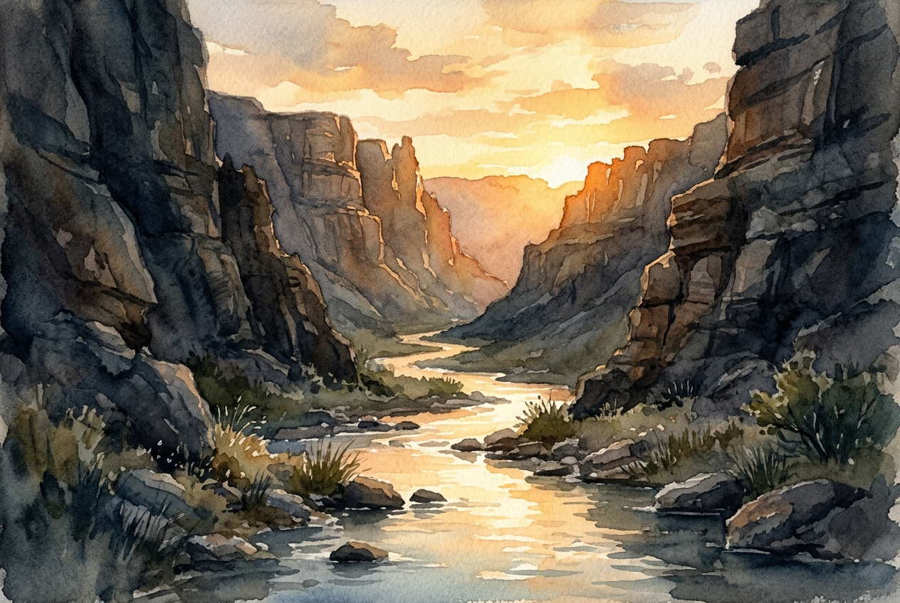

# Daily Reading: Psalm 23

*July 6, 2026*

> *(Image: A gentle stream flowing through a rugged, shadowed canyon, catching the warm, golden light of a breaking dawn.)*

## The Reading (NLT)

**Psalm 23**

> 1 The Lord is my shepherd; I have all that I need. 2 He lets me rest in green meadows; he leads me beside peaceful streams. 3 He renews my strength. He guides me along right paths, bringing honor to his name. 4 Even when I walk through the darkest valley, I will not be afraid, for you are close beside me. Your rod and your staff protect and comfort me. 5 You prepare a feast for me in the presence of my enemies. You honor me by anointing my head with oil. My cup overflows with blessings. 6 Surely your goodness and unfailing love will pursue me all the days of my life, and I will live in the house of the Lord forever.

## The Story

The agrarian world of ancient Israel relied heavily on shepherds, individuals who lived entirely for the welfare of their flocks. This psalm draws on that intimate, daily reality to describe the divine relationship. A shepherd's role was comprehensive, involving navigation, protection from predators, and ensuring access to vital resources in an arid, unforgiving landscape. The imagery shifts seamlessly from the rugged wilderness to the hospitality of a generous host. In ancient Near Eastern culture, preparing a banquet and offering scented oils were profound gestures of protection and honor. The host assumed full responsibility for the guest's safety and satisfaction. Together, these metaphors paint a picture of a deity who is intimately involved in both survival and celebration.

## Application for Today

We often measure our security by the absence of trouble, assuming a peaceful life means avoiding dark valleys altogether. Yet this ancient song suggests that true safety is found in companionship rather than circumstance. The promise here is not immunity from exhaustion or fear, but rather the presence of a capable guide through those exact realities. When we face periods of scarcity or profound anxiety, we can lean into the assurance that we are not navigating the wilderness alone. The same care that provides moments of deep rest also stands guard when we feel surrounded by threats. Recognizing this protective presence allows us to experience profound gratitude, even before the danger has fully passed. We are invited to trust that enduring goodness follows us through every season.

---

*Scripture quotations are taken from the Holy Bible, New Living Translation, copyright © 1996, 2004, 2015 by Tyndale House Foundation. Used by permission of Tyndale House Publishers.*
