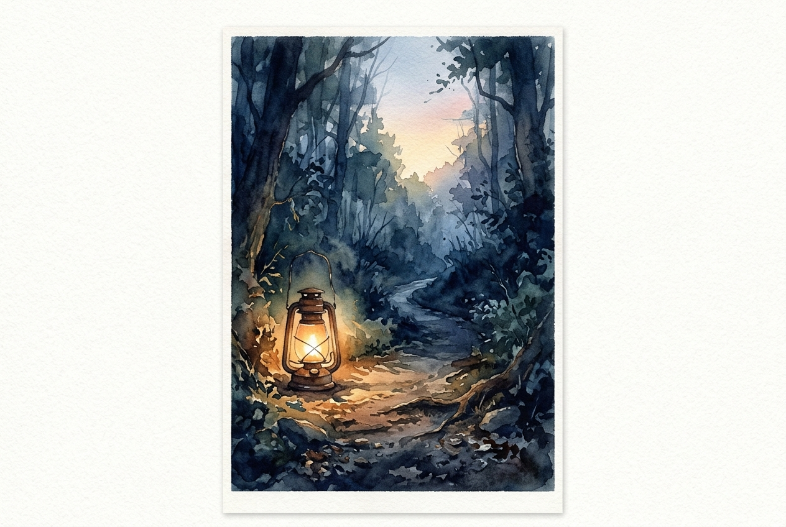

# Leitura Diária: John 3:16-21

*6 de julho de 2026*

> *(Image: A single lantern glowing softly on a rugged forest path at dawn casting warm golden light that gently pushes back the deep blue shadows of the surrounding woods.)*

## A Leitura (PT-NVI)

**John 3:16-21**

> 16 "Porque Deus tanto amou o mundo que deu o seu Filho Unigênito, para que todo o que nele crer não pereça, mas tenha a vida eterna. 17 Pois Deus enviou o seu Filho ao mundo, não para condenar o mundo, mas para que este fosse salvo por meio dele. 18 Quem nele crê não é condenado, mas quem não crê já está condenado, por não crer no nome do Filho Unigênito de Deus. 19 Este é o julgamento: a luz veio ao mundo, mas os homens amaram as trevas, e não a luz, porque as suas obras eram más. 20 Quem pratica o mal odeia a luz e não se aproxima da luz, temendo que as suas obras sejam manifestas. 21 Mas quem pratica a verdade vem para a luz, para que se veja claramente que as suas obras são realizadas por intermédio de Deus".

## A História

O Evangelho de João frequentemente utiliza contrastes marcantes para explicar realidades espirituais, descrevendo o mundo em termos de luz e escuridão. No mundo antigo, a noite era um momento de verdadeira vulnerabilidade e ocultamento, tornando a luz um símbolo poderoso de verdade, segurança e presença divina. O texto explica a motivação central por trás da chegada do Messias. Não foi uma missão de hostilidade ou punição, embora muitos esperassem um juiz conquistador que consertasse o mundo à força. Em vez disso, a narrativa revela um ato de resgate impulsionado inteiramente pelo amor. A chegada dessa luz divina impõe uma escolha entre permanecer escondido nas sombras da vergonha ou dar um passo à frente para ser visto.

## Aplicação para Hoje

É profundamente humano querer esconder nossas falhas, nossos erros e as partes de nós mesmos que tememos ser inaceitáveis. Muitas vezes esperamos que sermos verdadeiramente vistos pelo divino resultará em condenação imediata. No entanto, esta passagem desconstrói esse medo, garantindo-nos que o propósito final da aproximação de Deus é o resgate, não a ruína. A luz não tem a intenção de ser um holofote severo de interrogatório, mas sim um farol que nos guia para fora do isolamento. Entrar nessa luz exige vulnerabilidade, pedindo-nos para confiar que seremos recebidos com graça em vez de julgamento. Quando paramos de nos esconder, permitimos que o trabalho de cura do amor comece, descobrindo que o lugar mais seguro para se estar é onde somos totalmente conhecidos.

---

*Citações bíblicas extraídas da Nova Versão Internacional (NVI), © 1993, 2000 por Biblica, Inc. Usado com permissão.*
