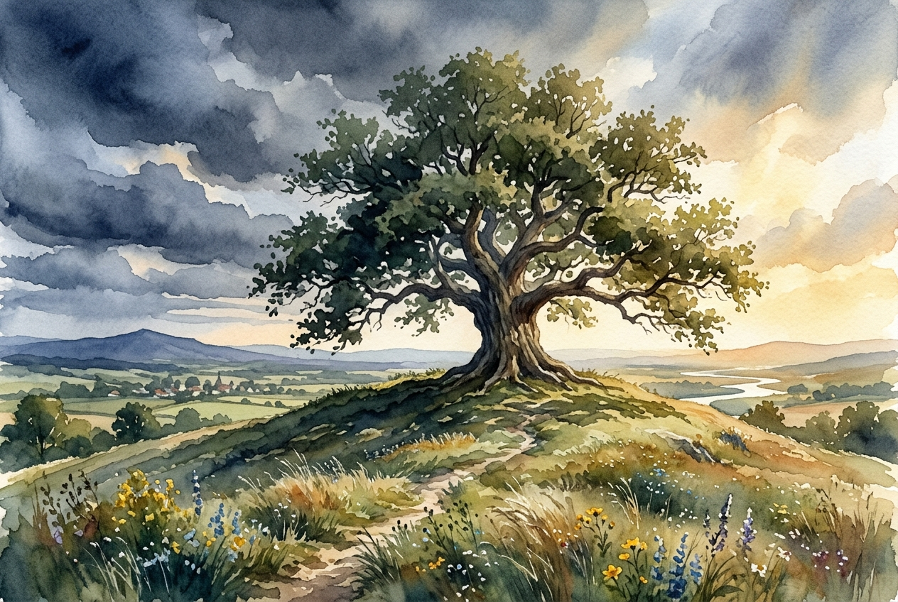

# Leitura Diária: Psalm 91

*7 de julho de 2026*

> *(Image: A sturdy ancient oak tree stands tall on a grassy hill, its wide branches offering deep shade and shelter while warm sunlight breaks through dark, retreating storm clouds.)*

## A Leitura (PT-NVI)

**Psalm 91**

> 1 Aquele que habita no abrigo do Altíssimo e descansa à sombra do Todo-poderoso 2 pode dizer ao Senhor: Tu és o meu refúgio e a minha fortaleza, o meu Deus, em quem confio. 3 Ele o livrará do laço do caçador e do veneno mortal. 4 Ele o cobrirá com as suas penas, e sob as suas asas você encontrará refúgio; a fidelidade dele será o seu escudo protetor. 5 Você não temerá o pavor da noite, nem a flecha que voa de dia, 6 nem a peste que se move sorrateira nas trevas, nem a praga que devasta ao meio-dia. 7 Mil poderão cair ao seu lado, dez mil à sua direita, mas nada o atingirá. 8 Você simplesmente olhará, e verá o castigo dos ímpios. 9 Se você fizer do Altíssimo o seu refúgio, 10 nenhum mal o atingirá, desgraça alguma chegará à sua tenda. 11 Porque a seus anjos ele dará ordens a seu respeito, para que o protejam em todos os seus caminhos; 12 com as mãos eles o segurarão, para que você não tropece em alguma pedra. 13 Você pisará o leão e a cobra; pisoteará o leão forte e a serpente. 14 "Porque ele me ama, eu o resgatarei; eu o protegerei, pois conhece o meu nome. 15 Ele clamará a mim, e eu lhe darei resposta, e na adversidade estarei com ele; vou livrá-lo e cobri-lo de honra. 16 Vida longa eu lhe darei, e lhe mostrarei a minha salvação. "

## A História

O mundo antigo era repleto de perigos imprevisíveis, desde enfermidades repentinas até a violência da guerra. O salmista captura essa realidade ao reconhecer os medos que surgem durante a noite e as ameaças que chegam à luz do dia. Em vez de prometer um mundo sem riscos, o autor aponta para uma fonte inabalável de segurança. As imagens retratam uma ave protegendo seus filhotes e uma enorme fortaleza de pedra oferecendo um porto seguro. Esse cântico antigo provavelmente era usado por pessoas que enfrentavam riscos iminentes, lembrando-as de onde reside a verdadeira proteção. O texto apresenta a fé não como imunidade contra as dificuldades, mas como uma proximidade íntima com o divino.

## Aplicação para Hoje

Ainda enfrentamos um mundo cheio de ameaças invisíveis e ansiedades repentinas que podem facilmente nos sobrecarregar. Quando o medo começa a tomar conta, esta passagem nos convida a mudar nosso foco do perigo ao nosso redor para o abrigo acima de nós. Confiar em Deus não significa que nunca passaremos por dores ou dificuldades, mas nos garante que jamais seremos deixados sozinhos para enfrentá-las. Somos convidados a descansar em uma presença que é maior do que nossos medos mais profundos. Ao escolher buscar refúgio no divino, encontramos uma paz constante que transcende nossas circunstâncias. Podemos caminhar por nossos dias sabendo que estamos amparados com segurança, mesmo quando o chão parece instável.

---

*Citações bíblicas extraídas da Nova Versão Internacional (NVI), © 1993, 2000 por Biblica, Inc. Usado com permissão.*
