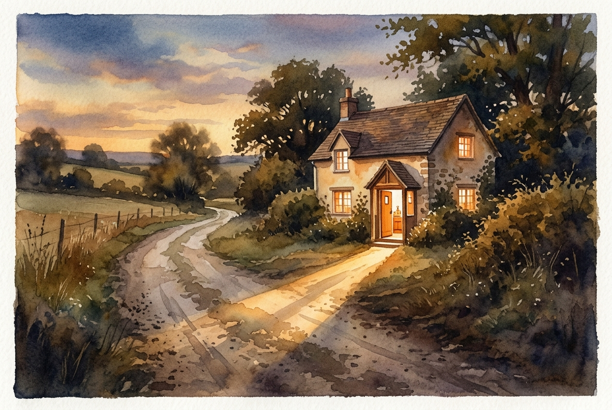

# Leitura Diária: Luke 15:11-32

*8 de julho de 2026*

> *(Image: A dusty rural road leading toward a warm, brightly lit house at dusk, with an open door casting a long, inviting shadow across the path.)*

## A Leitura (PT-NVI)

**Luke 15:11-32**

> 11 Jesus continuou: "Um homem tinha dois filhos. 12 O mais novo disse ao seu pai: ‘Pai, quero a minha parte da herança’. Assim, ele repartiu sua propriedade entre eles. 13 "Não muito tempo depois, o filho mais novo reuniu tudo o que tinha, e foi para uma região distante; e lá desperdiçou os seus bens vivendo irresponsavelmente. 14 Depois de ter gasto tudo, houve uma grande fome em toda aquela região, e ele começou a passar necessidade. 15 Por isso foi empregar-se com um dos cidadãos daquela região, que o mandou para o seu campo a fim de cuidar de porcos. 16 Ele desejava encher o estômago com as vagens de alfarrobeira que os porcos comiam, mas ninguém lhe dava nada. 17 "Caindo em si, ele disse: ‘Quantos empregados de meu pai têm comida de sobra, e eu aqui, morrendo de fome! 18 Eu me porei a caminho e voltarei para meu pai, e lhe direi: Pai, pequei contra o céu e contra ti. 19 Não sou mais digno de ser chamado teu filho; trata-me como um dos teus empregados’. 20 A seguir, levantou-se e foi para seu pai. "Estando ainda longe, seu pai o viu e, cheio de compaixão, correu para seu filho, e o abraçou e beijou. 21 "O filho lhe disse: ‘Pai, pequei contra o céu e contra ti. Não sou mais digno de ser chamado teu filho’. 22 "Mas o pai disse aos seus servos: ‘Depressa! Tragam a melhor roupa e vistam nele. Coloquem um anel em seu dedo e calçados em seus pés. 23 Tragam o novilho gordo e matem-no. Vamos fazer uma festa e comemorar. 24 Pois este meu filho estava morto e voltou à vida; estava perdido e foi achado’. E começaram a festejar. 25 "Enquanto isso, o filho mais velho estava no campo. Quando se aproximou da casa, ouviu a música e a dança. 26 Então chamou um dos servos e perguntou-lhe o que estava acontecendo. 27 Este lhe respondeu: ‘Seu irmão voltou, e seu pai matou o novilho gordo, porque o recebeu de volta são e salvo’. 28 "O filho mais velho encheu-se de ira, e não quis entrar. Então seu pai saiu e insistiu com ele. 29 Mas ele respondeu ao seu pai: ‘Olha! todos esses anos tenho trabalhado como um escravo ao teu serviço e nunca desobedeci às tuas ordens. Mas tu nunca me deste nem um cabrito para eu festejar com os meus amigos. 30 Mas quando volta para casa esse seu filho, que esbanjou os teus bens com as prostitutas, matas o novilho gordo para ele! ’ 31 "Disse o pai: ‘Meu filho, você está sempre comigo, e tudo o que tenho é seu. 32 Mas nós tínhamos que comemorar e alegrar-nos, porque este seu irmão estava morto e voltou à vida, estava perdido e foi achado’ ".

## A História

Jesus conta a história de uma família fragmentada por dois tipos muito diferentes de rebelião. Um dos filhos exige sua herança antecipadamente, uma ofensa profunda na época, e desperdiça tudo em uma terra distante até chegar ao fundo do poço. O outro filho permanece em casa, trabalhando arduamente, mas nutre um ressentimento silencioso, enxergando a relação com o pai como um simples contrato de dívidas e pagamentos. Quando o filho mais novo finalmente retorna, esperando ser tratado como um mero empregado, o pai abandona todo o decoro de sua posição e corre para abraçá-lo. No entanto, a narrativa não se encerra nesse reencontro; o pai também deixa a festa para ir ao encontro de seu filho mais velho, que estava do lado de fora, rígido e furioso.

## Aplicação para Hoje

É comum nos identificarmos com um desses dois irmãos em diferentes momentos da vida. Às vezes fugimos para longe, convencidos de que nossos erros nos desqualificaram permanentemente de qualquer afeto ou aceitação. Outras vezes, ficamos por perto, mas tratamos nossa fé como uma transação, acreditando que nossa obediência nos garante um lugar de superioridade. O ponto central e surpreendente dessa narrativa não é a atitude dos filhos, mas a busca incansável do pai. Ele não espera que o filho rebelde implore por perdão, nem ignora a amargura do filho obediente. Ele vai ao encontro de ambos, oferecendo uma graça que não pode ser comprada nem esgotada, lembrando-nos de que sempre há lugar para nós em sua mesa.

---

*Citações bíblicas extraídas da Nova Versão Internacional (NVI), © 1993, 2000 por Biblica, Inc. Usado com permissão.*
