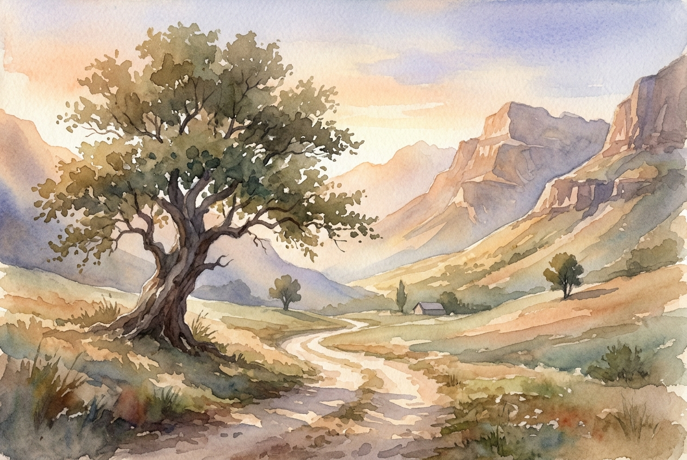

# Daily Reading: Psalm 121

*July 9, 2026*

> *(Image: A serene, winding dirt path leading through majestic mountains at dawn, bathed in warm sunlight and partially shaded by a large ancient tree.)*

## The Reading (NLT)

**Psalm 121**

> 1 I look up to the mountainsdoes my help come from there? 2 My help comes from the Lord, who made heaven and earth! 3 He will not let you stumble; the one who watches over you will not slumber. 4 Indeed, he who watches over Israel never slumbers or sleeps. 5 The Lord himself watches over you! The Lord stands beside you as your protective shade. 6 The sun will not harm you by day, nor the moon at night. 7 The Lord keeps you from all harm and watches over your life. 8 The Lord keeps watch over you as you come and go, both now and forever.

## The Story

Ancient travelers heading to Jerusalem faced treacherous terrain. The roads winding through the hills were often plagued by extreme weather, wild animals, and thieves waiting in ambush. Looking up at the towering peaks could easily inspire dread rather than awe. For a pilgrim on foot, the journey was an act of profound vulnerability. Yet, this song shifts the traveler's focus from the immediate threats of the landscape to the one who carved it. The psalmist reminds the weary traveler that the ultimate guardian is not a local deity bound to a specific hill, but the tireless Creator of the entire cosmos.

## Application for Today

We all navigate seasons where the path ahead feels steep and full of hidden dangers. It is natural to scan the horizon and wonder how we will survive the climb. When anxiety threatens to overwhelm us, we are invited to redirect our gaze. The same presence that sustains the universe is intimately invested in the details of our daily lives. We are assured of a watchful care that never fatigues, even when our own strength gives out. Knowing that our steps are guarded gives us the courage to keep walking, trusting that we are held secure from the beginning of our journey to its end.

---

*Scripture quotations are taken from the Holy Bible, New Living Translation, copyright © 1996, 2004, 2015 by Tyndale House Foundation. Used by permission of Tyndale House Publishers.*
