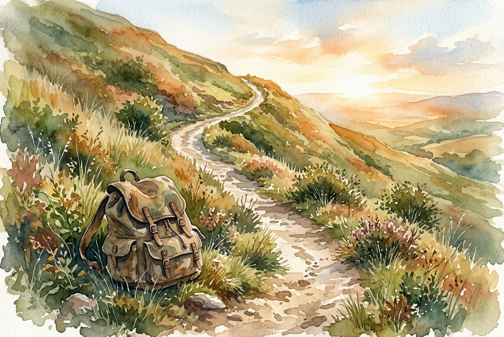

# Leitura Diária: Hebrews 12:1-3

*9 de julho de 2026*

> *(Image: A winding dirt path climbing a steep hill toward a bright horizon, with a heavy, discarded canvas backpack resting on the grass beside the trail.)*

## A Leitura (PT-NVI)

**Hebrews 12:1-3**

> 1 Portanto, também nós, uma vez que estamos rodeados por tão grande nuvem de testemunhas, livremo-nos de tudo o que nos atrapalha e do pecado que nos envolve, e corramos com perseverança a corrida que nos é proposta, 2 tendo os olhos fitos em Jesus, autor e consumador da nossa fé. Ele, pela alegria que lhe fora proposta, suportou a cruz, desprezando a vergonha, e assentou-se à direita do trono de Deus. 3 Pensem bem naquele que suportou tal oposição dos pecadores contra si mesmo, para que vocês não se cansem nem se desanimem.

## A História

O público original desta carta estava exausto. Eles enfrentavam rejeição social e perseguição por causa de sua fé, e muitos sentiam a tentação de desistir e voltar à antiga vida. O autor usa a imagem de uma grande competição atlética em um estádio lotado. Nas corridas antigas, os atletas se desfaziam de qualquer roupa ou peso extra que pudesse atrasá-los. O texto então aponta para o corredor definitivo, que já completou o percurso mais difícil de todos. Ele enfrentou oposição e humilhação terríveis, mas suportou a dor mantendo o foco na imensa alegria que o aguardava na linha de chegada.

## Aplicação para Hoje

A vida muitas vezes não se parece com uma corrida rápida, mas sim com uma caminhada longa e íngreme. Ao longo do caminho, temos a tendência de acumular bagagens desnecessárias como ressentimentos, ansiedade, maus hábitos e distrações que tornam cada passo mais pesado. Quando a estrada fica difícil e as forças diminuem, somos convidados a deixar esses fardos à beira do caminho. Não precisamos carregá-los. Em vez disso, podemos fixar nosso olhar naquele que já percorreu a trilha mais árdua. Ao lembrar de como ele suportou os vales mais escuros, encontramos forças para dar mais um passo, e depois outro, sem desanimar.

---

*Citações bíblicas extraídas da Nova Versão Internacional (NVI), © 1993, 2000 por Biblica, Inc. Usado com permissão.*
