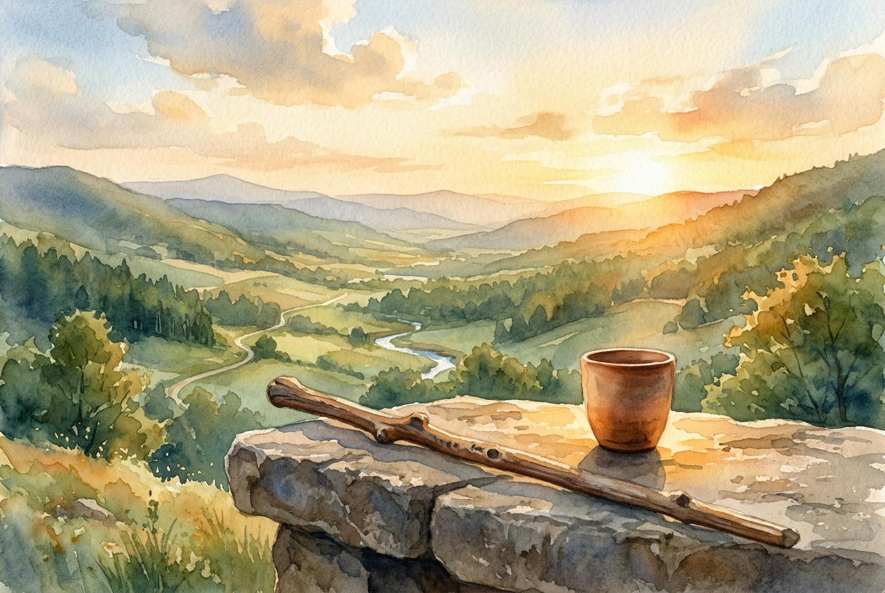

# Leitura Diária: Psalm 23

*10 de julho de 2026*

> *(Image: A solitary wooden walking stick rests against a stone table set with a simple clay cup bathed in warm golden hour light overlooking a lush quiet valley.)*

## A Leitura (PT-NVI)

**Psalm 23**

> 1 O Senhor é o meu pastor; de nada terei falta. 2 Em verdes pastagens me faz repousar e me conduz a águas tranqüilas; 3 restaura-me o vigor. Guia-me nas veredas da justiça por amor do seu nome. 4 Mesmo quando eu andar por um vale de trevas e morte, não temerei perigo algum, pois tu estás comigo; a tua vara e o teu cajado me protegem. 5 Preparas um banquete para mim à vista dos meus inimigos. Tu me honras, ungindo a minha cabeça com óleo e fazendo transbordar o meu cálice. 6 Sei que a bondade e a fidelidade me acompanharão todos os dias da minha vida, e voltarei à casa do Senhor enquanto eu viver.

## A História

Na antiguidade do Oriente Médio, os pastores não apenas empurravam o rebanho por trás, mas iam à frente, garantindo a segurança e buscando recursos escassos em terras áridas. O poema faz uma transição belíssima: começa falando sobre o divino na terceira pessoa e passa a se dirigir ao Criador na segunda pessoa exatamente no momento de maior escuridão. Essa mudança literária marca uma intimidade profunda que nasce da vulnerabilidade. A imagem então evolui de um guia pastoral no campo aberto para o ambiente de um anfitrião generoso que oferece santuário. Naquela cultura, receber alguém significava assumir total responsabilidade por sua proteção e honra. A jornada descrita não ignora a realidade dura do deserto, mas a transforma pela presença de quem lidera o caminho.

## Aplicação para Hoje

É comum desejarmos uma existência totalmente protegida das dificuldades ou da hostilidade. No entanto, este poema milenar não promete a ausência do perigo, da exaustão ou dos adversários. Em vez disso, ele oferece a garantia profunda de uma companhia divina constante. Quando o terreno se torna traiçoeiro e as sombras se alongam, não somos abandonados para enfrentar os obstáculos sozinhos. O anfitrião celestial já garantiu nosso espaço, oferecendo descanso e dignidade mesmo quando as circunstâncias parecem esmagadoras. Podemos seguir em frente com uma confiança serena, sabendo que um amor leal e incansável segue de perto os nossos passos todos os dias.

---

*Citações bíblicas extraídas da Nova Versão Internacional (NVI), © 1993, 2000 por Biblica, Inc. Usado com permissão.*
