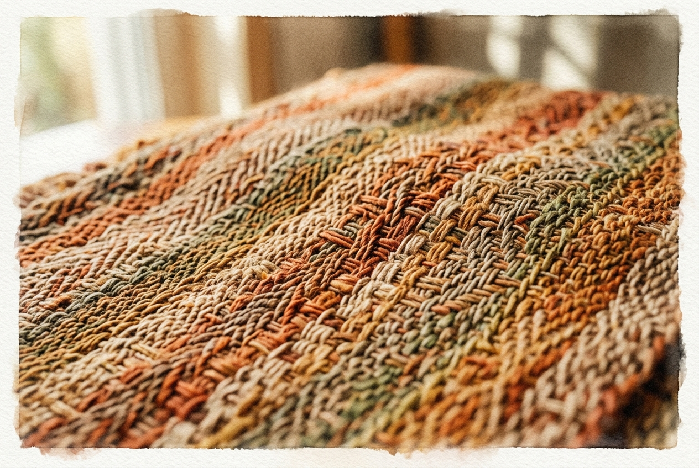

# Leitura Diária: Colossians 3:12-17

*10 de julho de 2026*

> *(Image: A close-up of beautifully woven textured fabric in warm earth tones with threads binding together in a seamless strong pattern.)*

## A Leitura (PT-NVI)

**Colossians 3:12-17**

> 12 Portanto, como povo escolhido de Deus, santo e amado, revistam-se de profunda compaixão, bondade, humildade, mansidão e paciência. 13 Suportem-se uns aos outros e perdoem as queixas que tiverem uns contra os outros. Perdoem como o Senhor lhes perdoou. 14 Acima de tudo, porém, revistam-se do amor, que é o elo perfeito. 15 Que a paz de Cristo seja o juiz em seus corações, visto que vocês foram chamados a viver em paz, como membros de um só corpo. E sejam agradecidos. 16 Habite ricamente em vocês a palavra de Cristo; ensinem e aconselhem-se uns aos outros com toda a sabedoria, e cantem salmos, hinos e cânticos espirituais com gratidão a Deus em seus corações. 17 Tudo o que fizerem, seja em palavra ou em ação, façam-no em nome do Senhor Jesus, dando por meio dele graças a Deus Pai.

## A História

No mundo mediterrâneo antigo, as roupas eram um dos principais marcadores de identidade, status e lealdade. Ao escrever para essa comunidade cristã primitiva, o autor usa a metáfora cotidiana de vestir-se para descrever uma profunda transformação interna. Em vez de ostentar trajes que sinalizassem riqueza ou poder, os seguidores desse novo caminho são chamados a se cobrir com virtudes que fortalecem o convívio. O texto destaca que essas características não são apenas conquistas individuais, mas ferramentas relacionais. Elas funcionam como os fios que mantêm unido um grupo diversificado de pessoas, criando uma estrutura resistente, tecida com graça intencional e tolerância mútua.

## Aplicação para Hoje

Muitas vezes encaramos o crescimento espiritual como uma busca solitária, uma jornada particular de aperfeiçoamento. No entanto, essa passagem nos lembra de que a fé se concretiza nos atritos e nas belezas dos relacionamentos. Quando nos deparamos com os aborrecimentos inevitáveis e as mágoas profundas de conviver com os outros, somos convidados a escolher uma resposta diferente. Permitir que uma paz profunda direcione nossos corações significa deixar que uma presença serena e estabilizadora guie nossas reações. É uma decisão diária de vestir a compaixão e a paciência, reconhecendo que nossas atitudes cotidianas têm o poder de tecer uma comunidade mais forte e acolhedora ao nosso redor.

---

*Citações bíblicas extraídas da Nova Versão Internacional (NVI), © 1993, 2000 por Biblica, Inc. Usado com permissão.*
