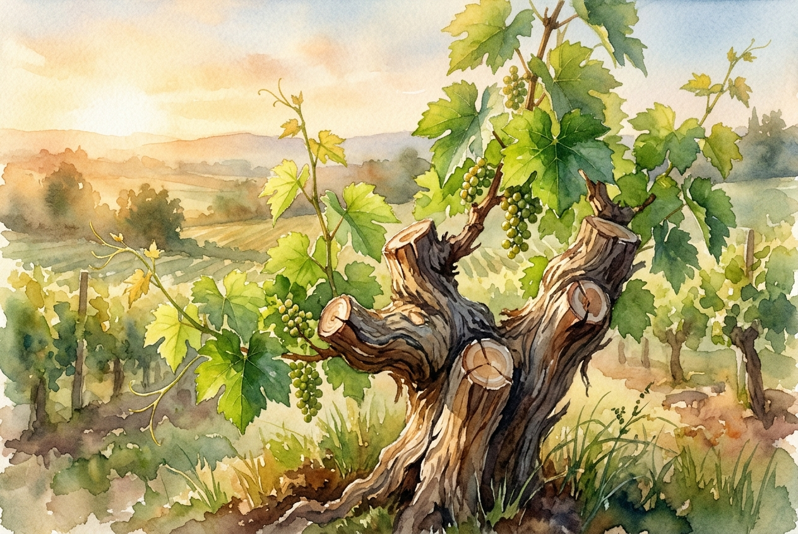

# Daily Reading: John 15:1-11

*July 11, 2026*

> *(Image: A close-up view of a vibrant green grapevine in the warm golden light of early morning, with careful pruning cuts visible on the mature wooden trunk.)*

## The Reading (NLT)

**John 15:1-11**

> 1 I am the true grapevine, and my Father is the gardener. 2 He cuts off every branch of mine that doesn't produce fruit, and he prunes the branches that do bear fruit so they will produce even more. 3 You have already been pruned and purified by the message I have given you. 4 Remain in me, and I will remain in you. For a branch cannot produce fruit if it is severed from the vine, and you cannot be fruitful unless you remain in me. 5 Yes, I am the vine; you are the branches. Those who remain in me, and I in them, will produce much fruit. For apart from me you can do nothing. 6 Anyone who does not remain in me is thrown away like a useless branch and withers. Such branches are gathered into a pile to be burned. 7 But if you remain in me and my words remain in you, you may ask for anything you want, and it will be granted! 8 When you produce much fruit, you are my true disciples. This brings great glory to my Father. 9 I have loved you even as the Father has loved me. Remain in my love. 10 When you obey my commandments, you remain in my love, just as I obey my Father's commandments and remain in his love. 11 I have told you these things so that you will be filled with my joy. Yes, your joy will overflow!

## The Story

In the ancient Mediterranean world, vineyards were a familiar and essential part of the landscape. When Jesus speaks to his disciples on the night before his death, he uses this everyday agricultural image to explain the nature of their relationship. He describes a careful gardener tending to a sprawling vine, cutting away dead wood and trimming back healthy branches so they can thrive even more. The focus is not on the branch's independent effort, but on its vital connection to the central trunk. Life and nourishment flow from the source, making growth a natural result of simply staying attached. The disciples are invited into an intimate, sustaining bond rather than a checklist of religious duties.

## Application for Today

We often treat spiritual growth as a project we have to manage through sheer willpower and exhaustion. We try to manufacture our own purpose, forgetting that a branch severed from its source quickly dries up. This passage invites us to shift our focus from frantic production to deep connection. When we prioritize resting in divine love and aligning our daily choices with that love, the resulting growth happens organically. Pruning might feel uncomfortable in the moment, as distractions and unhealthy habits are stripped away. Yet this careful tending is exactly what allows us to experience a profound, overflowing joy in our everyday lives.

---

*Scripture quotations are taken from the Holy Bible, New Living Translation, copyright © 1996, 2004, 2015 by Tyndale House Foundation. Used by permission of Tyndale House Publishers.*
