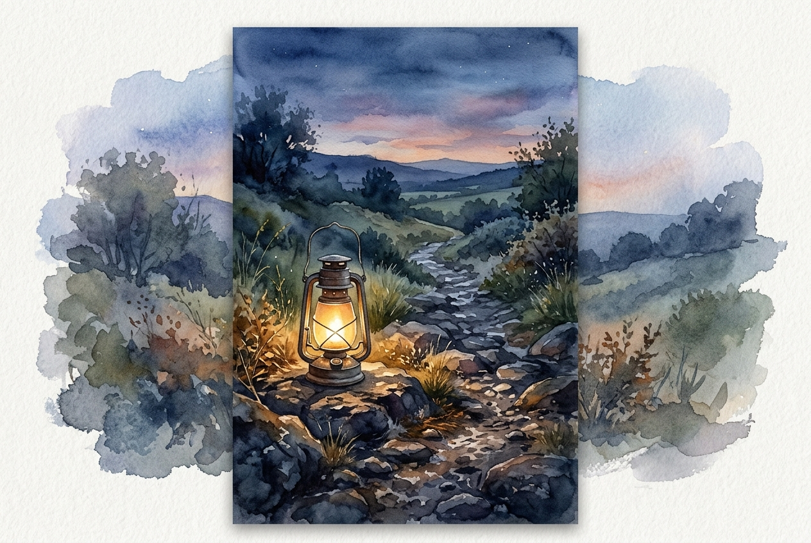

# Daily Reading: John 3:16-21

*July 12, 2026*

> *(Image: A lantern resting on a rocky path at twilight, casting a warm golden glow that gently pushes back the gathering shadows.)*

## The Reading (NLT)

**John 3:16-21**

> 16 For this is how God loved the world: He gave his one and only Son, so that everyone who believes in him will not perish but have eternal life. 17 God sent his Son into the world not to judge the world, but to save the world through him. 18 There is no judgment against anyone who believes in him. But anyone who does not believe in him has already been judged for not believing in God's one and only Son. 19 And the judgment is based on this fact: God's light came into the world, but people loved the darkness more than the light, for their actions were evil. 20 All who do evil hate the light and refuse to go near it for fear their sins will be exposed. 21 But those who do what is right come to the light so others can see that they are doing what God wants.

## The Story

In the ancient world, nightfall brought genuine peril and profound vulnerability. Without city lights or reliable illumination, darkness was a tangible force that hid danger and isolated communities. When John writes about light entering the world, he is tapping into this primal human experience of seeking safety and clarity. The conversation recorded here happens under the cover of night, a fitting backdrop for a discussion about hiding versus being seen. The invitation is not presented as a harsh spotlight designed to shame, but rather as a rescue mission. The Creator's primary posture toward humanity is described not as a judge eager to condemn, but as a rescuer driven by an expansive, self-giving love.

## Application for Today

We often carry an underlying fear that if God truly saw everything about us, the result would be instant rejection. This passage dismantles that anxiety by revealing the divine motive behind the rescue effort. The light is not an interrogation lamp; it is the break of dawn after a long, restless night. When we choose to step out of our hidden places, we are not walking toward a courtroom, but toward a space of healing and restoration. Acknowledging our flaws and stepping into the open allows us to experience the depth of that original, saving love. We no longer have to exhaust ourselves by hiding in the shadows.

---

*Scripture quotations are taken from the Holy Bible, New Living Translation, copyright © 1996, 2004, 2015 by Tyndale House Foundation. Used by permission of Tyndale House Publishers.*
