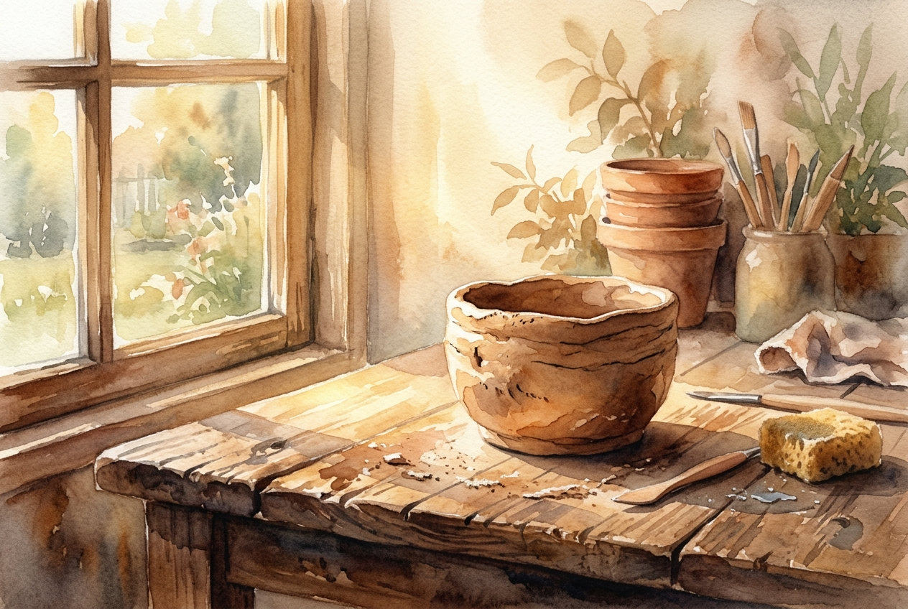

# Daily Reading: Ephesians 2:1-10

*July 13, 2026*

> *(Image: A piece of unfinished pottery resting on a wooden workbench, bathed in the warm, golden light of early morning.)*

## The Reading (NLT)

**Ephesians 2:1-10**

> 1 Once you were dead because of your disobedience and your many sins. 2 You used to live in sin, just like the rest of the world, obeying the devil the commander of the powers in the unseen world. He is the spirit at work in the hearts of those who refuse to obey God. 3 All of us used to live that way, following the passionate desires and inclinations of our sinful nature. By our very nature we were subject to God's anger, just like everyone else. 4 But God is so rich in mercy, and he loved us so much, 5 that even though we were dead because of our sins, he gave us life when he raised Christ from the dead. (It is only by God's grace that you have been saved!) 6 For he raised us from the dead along with Christ and seated us with him in the heavenly realms because we are united with Christ Jesus. 7 So God can point to us in all future ages as examples of the incredible wealth of his grace and kindness toward us, as shown in all he has done for us who are united with Christ Jesus. 8 God saved you by his grace when you believed. And you can't take credit for this; it is a gift from God. 9 Salvation is not a reward for the good things we have done, so none of us can boast about it. 10 For we are God's masterpiece. He has created us anew in Christ Jesus, so we can do the good things he planned for us long ago.

## The Story

Paul writes to a community in Ephesus deeply aware of the contrast between their former lives and their present reality. He paints a stark picture of human existence apart from divine intervention, describing a state of spiritual lifelessness driven by the destructive currents of the culture around them. The turning point of his argument rests entirely on the character of the Creator, whose abundant compassion interrupts this bleak trajectory. Rather than demanding people fix themselves, the author emphasizes that rescue comes purely as an unearned gift. This shifts the focus from human effort to divine generosity, portraying believers as a carefully crafted work of art rather than a product of their own striving.

## Application for Today

We often measure our worth by our productivity, our moral track record, or our ability to get things right. This passage invites us to lay down the exhausting burden of trying to earn our place. You are not a resume of accomplishments or a ledger of failures, but a deliberate creation shaped by a merciful artist. The good things we do are not stepping stones to win approval, but the natural outpouring of a life already secured by grace. When we understand ourselves as a masterpiece, our daily actions transform from obligations into a joyful participation in the work we were designed to do.

---

*Scripture quotations are taken from the Holy Bible, New Living Translation, copyright © 1996, 2004, 2015 by Tyndale House Foundation. Used by permission of Tyndale House Publishers.*
