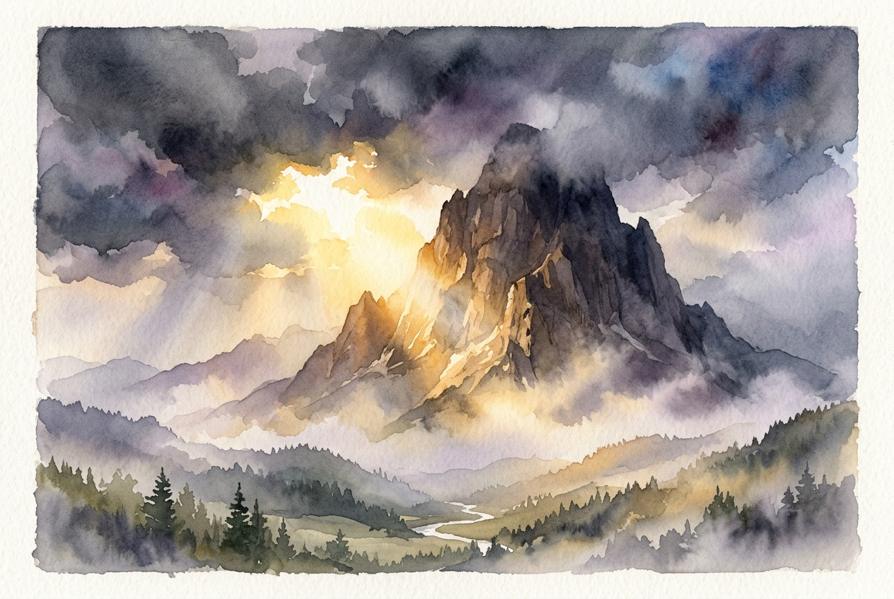

# Leitura Diária: 2 Corinthians 4:16-18

*14 de julho de 2026*

> *(Image: A majestic, ancient mountain peak partially obscured by dark storm clouds, with brilliant golden sunlight breaking through the mist to illuminate the immovable solid rock beneath.)*

## A Leitura (PT-NVI)

**2 Corinthians 4:16-18**

> 16 Por isso não desanimamos. Embora exteriormente estejamos a desgastar-nos, interiormente estamos sendo renovados dia após dia, 17 pois os nossos sofrimentos leves e momentâneos estão produzindo para nós uma glória eterna que pesa mais do que todos eles. 18 Assim, fixamos os olhos, não naquilo que se vê, mas no que não se vê, pois o que se vê é transitório, mas o que não se vê é eterno.

## A História

O apóstolo Paulo escreveu para uma comunidade em Corinto que conhecia profundamente as dificuldades, a perseguição e a fragilidade da vida humana. Seu próprio ministério foi marcado por naufrágios, agressões e um desgaste físico constante. No entanto, ele ressignificou essas experiências exaustivas não como derrotas definitivas, mas como condições temporárias diante de um horizonte muito mais amplo. Ele apresentou um paradoxo profundo aos seus leitores, contrastando a decadência visível do mundo físico com a natureza invisível e duradoura da vitalidade espiritual. Ao desviar o foco do sofrimento imediato, ele convidou a igreja primitiva a reconhecer uma transformação contínua e profunda acontecendo sob a superfície. Essa perspectiva não era uma negação da dor, mas uma reavaliação do que realmente tem um significado permanente.

## Aplicação para Hoje

É extremamente fácil nos deixarmos consumir pelas lutas palpáveis que estão bem à nossa frente. Doenças, pressões financeiras e conflitos nos relacionamentos exigem nossa atenção imediata e, muitas vezes, esgotam nossa energia. Quando estamos exaustos por essas realidades visíveis, a ideia de uma dimensão eterna e invisível pode parecer abstrata. Contudo, adotar essa visão de longo prazo nos oferece uma resiliência silenciosa no meio de nossas batalhas diárias. Somos convidados a confiar que nosso caráter interno e nossa conexão com o sagrado estão sendo silenciosamente reconstruídos, mesmo quando as circunstâncias continuam difíceis. Focar naquilo que permanece nos ajuda a enfrentar as tempestades que podemos ver agora, ancorando nossa esperança em uma realidade que sobrevive à nossa dor atual.

---

*Citações bíblicas extraídas da Nova Versão Internacional (NVI), © 1993, 2000 por Biblica, Inc. Usado com permissão.*
