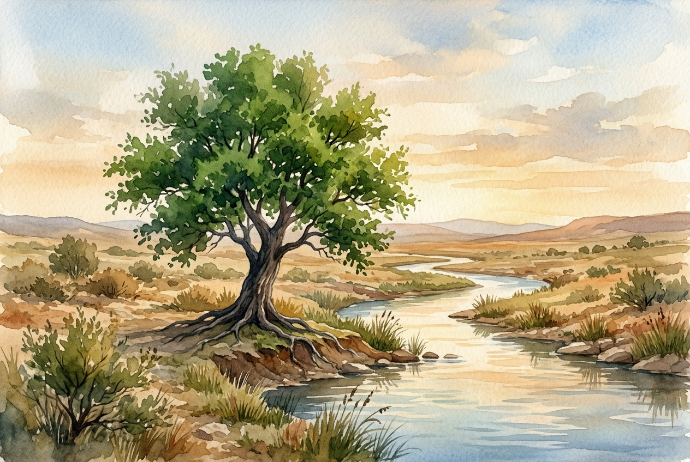

# Leitura Diária: Psalm 1

*14 de julho de 2026*

> *(Image: A solitary, deeply rooted tree standing vibrant and green on the edge of a quiet, flowing river in a dry landscape.)*

## A Leitura (PT-NVI)

**Psalm 1**

> 1 Como é feliz aquele que não segue o conselho dos ímpios, não imita a conduta dos pecadores, nem se assenta na roda dos zombadores! 2 Ao contrário, sua satisfação está na lei do Senhor, e nessa lei medita dia e noite. 3 É como árvore plantada à beira de águas correntes: Dá fruto no tempo certo e suas folhas não murcham. Tudo o que ele faz prospera! 4 Não é o caso dos ímpios! São como palha que o vento leva. 5 Por isso os ímpios não resistirão no julgamento, nem os pecadores na comunidade dos justos. 6 Pois o Senhor aprova o caminho dos justos, mas o caminho dos ímpios leva à destruição!

## A História

O Livro de Salmos não começa com uma oração, mas com um retrato vívido de dois caminhos de vida. Os leitores antigos viviam em um clima árido onde uma árvore frondosa era uma raridade, dependendo inteiramente de uma fonte constante de água. O salmista usa essa imagem para descrever uma vida ancorada na sabedoria divina. Em vez de se deixar levar pelas vozes cínicas ou destrutivas da multidão, essa pessoa encontra sua alegria no ritmo da instrução de Deus. A alternativa é descrita como a palha, a casca sem peso do grão que é facilmente levada por qualquer brisa. Este poema de abertura prepara o terreno para toda a coleção, sugerindo que a verdadeira estabilidade vem daquilo que escolhemos absorver.

## Aplicação para Hoje

Somos constantemente convidados a extrair nossa energia das correntes aceleradas e muitas vezes cínicas da cultura moderna. No entanto, esta antiga canção sugere uma maneira diferente de florescer, que depende de uma nutrição profunda e invisível. Quando ancoramos intencionalmente nossas mentes na sabedoria de Deus, desenvolvemos uma resiliência que sobrevive às tempestades passageiras. Esse tipo de sistema de raízes espirituais não promete uma vida livre de secas, mas garante que não murcharemos quando o calor chegar. O crescimento acontece silenciosamente, e os frutos aparecem no tempo certo. Ao escolhermos onde nos plantar, encontramos a força serena para permanecer firmes, não importa para onde o vento esteja soprando.

---

*Citações bíblicas extraídas da Nova Versão Internacional (NVI), © 1993, 2000 por Biblica, Inc. Usado com permissão.*
