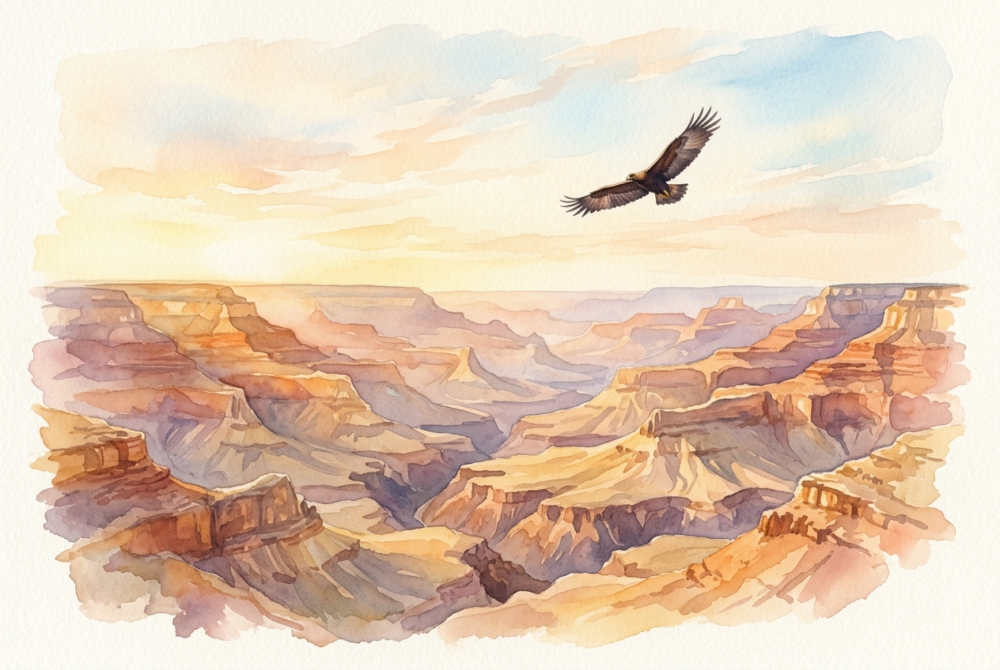

# Leitura Diária: Isaiah 40:28-31

*15 de julho de 2026*

> *(Image: A solitary eagle gliding effortlessly on thermal currents above a vast and sunlit canyon.)*

## A Leitura (PT-NVI)

**Isaiah 40:28-31**

> 28 Será que você não sabe? Nunca ouviu falar? O Senhor é o Deus eterno, o Criador de toda a terra. Ele não se cansa nem fica exausto, sua sabedoria é insondável. 29 Ele fortalece ao cansado e dá grande vigor ao que está sem forças. 30 Até os jovens se cansam e ficam exaustos, e os moços tropeçam e caem; 31 mas aqueles que esperam no Senhor renovam as suas forças. Voam bem alto como águias; correm e não ficam exaustos, andam e não se cansam.

## A História

O profeta se dirige a uma comunidade no exílio, um povo que se sente esquecido e completamente sem esperança. Eles observam seus próprios recursos esgotados e concluem que o futuro chegou ao fim. Em resposta, o texto desvia o olhar da fragilidade humana e aponta para a energia cósmica e inesgotável do Criador. A linguagem poética reconhece uma verdade universal de que até mesmo os mais vibrantes e jovens entre nós acabarão encontrando o limite da exaustão. No entanto, apresenta uma alternativa radical à autossuficiência, oferecendo uma troca profunda da nossa fraqueza pela vitalidade divina.

## Aplicação para Hoje

Vivemos em uma cultura que valoriza a produtividade infinita e a resiliência pessoal, muitas vezes nos pressionando até o colapso. Quando chegamos ao fim de nossas próprias forças, tendemos a sentir um peso de fracasso, como se fôssemos obrigados a continuar avançando indefinidamente. Esta passagem nos convida a aceitar nossos limites como uma parte natural do ser humano, e não como um defeito a ser escondido. Ao transferirmos nossa confiança da nossa própria resistência para o cuidado ilimitado do Criador, nos abrimos para um tipo diferente de perseverança. Às vezes, essa força divina se parece com um voo alto, mas, na maioria das vezes, ela simplesmente nos dá a graça necessária para continuar caminhando sem desistir.

---

*Citações bíblicas extraídas da Nova Versão Internacional (NVI), © 1993, 2000 por Biblica, Inc. Usado com permissão.*
