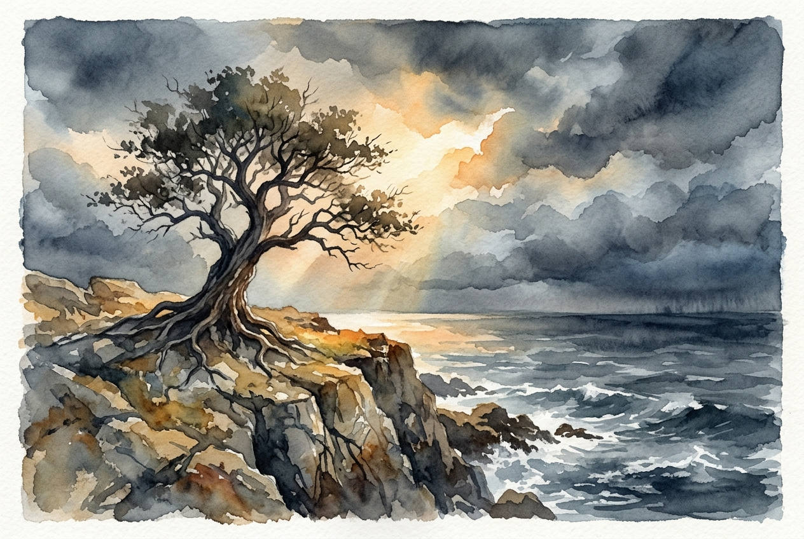

# Daily Reading: James 1:2-8

*July 15, 2026*

> *(Image: A solitary, deep-rooted tree standing firm on a rocky cliffside while a gentle but bright light breaks through heavy, dark storm clouds above.)*

## The Reading (NLT)

**James 1:2-8**

> 2 Dear brothers and sisters, when troubles of any kind come your way, consider it an opportunity for great joy. 3 For you know that when your faith is tested, your endurance has a chance to grow. 4 So let it grow, for when your endurance is fully developed, you will be perfect and complete, needing nothing. 5 If you need wisdom, ask our generous God, and he will give it to you. He will not rebuke you for asking. 6 But when you ask him, be sure that your faith is in God alone. Do not waver, for a person with divided loyalty is as unsettled as a wave of the sea that is blown and tossed by the wind. 7 Such people should not expect to receive anything from the Lord. 8 Their loyalty is divided between God and the world, and they are unstable in everything they do.

## The Story

The letter of James was written to a scattered, vulnerable community facing relentless pressure. These early believers were experiencing social and economic marginalization, making every day feel like a test of their survival. Rather than offering a formula to escape these hardships, the author reframes how to view them. The text presents trials not as a punishment to be avoided, but as the very environment where spiritual maturity is forged. It suggests that the friction of difficult circumstances is what builds genuine resilience. When the pressure reveals a lack of understanding, the community is encouraged to seek clarity from a God who gives generously, without keeping score.

## Application for Today

It is deeply counterintuitive to welcome hardship. When we encounter sudden difficulties or prolonged struggles, our first instinct is usually to find the quickest exit. Yet this passage invites us to pause and consider what might be growing in the dark. The resilience we so often wish we had is only ever developed by walking through the things we wish we could avoid. When the way forward is murky and our loyalties feel pulled in a dozen directions, we are invited to ask for wisdom. We do not need to have all the answers; we only need to anchor our trust in the One who offers steady guidance when the winds are howling.

---

*Scripture quotations are taken from the Holy Bible, New Living Translation, copyright © 1996, 2004, 2015 by Tyndale House Foundation. Used by permission of Tyndale House Publishers.*
