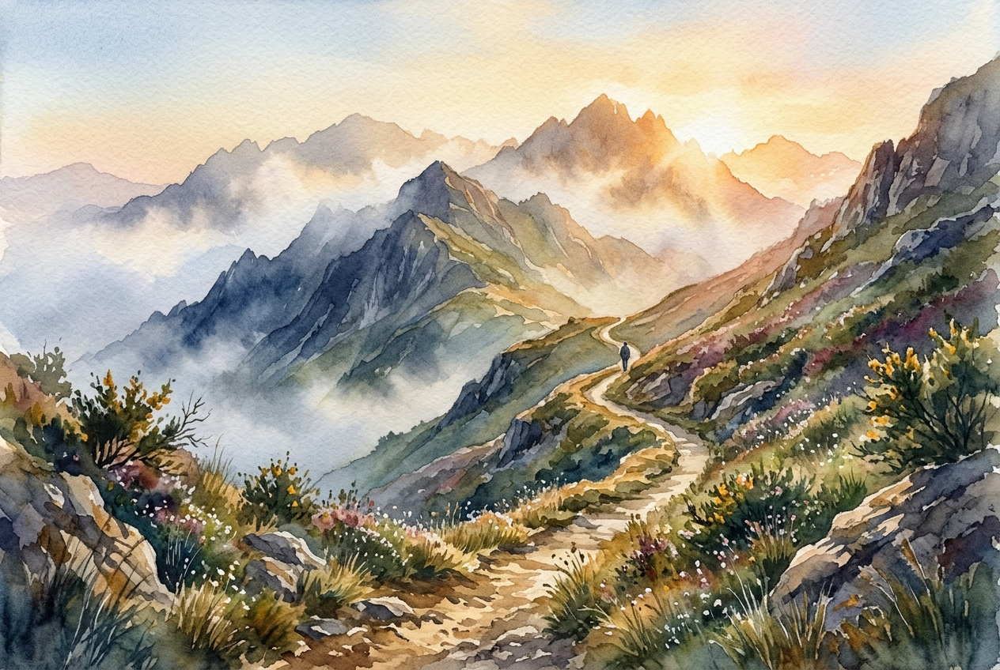

# Leitura Diária: Psalm 121

*16 de julho de 2026*

> *(Image: A serene, winding dirt path climbing through rugged, misty mountains just as the warm, golden light of dawn breaks over the highest peaks.)*

## A Leitura (PT-NVI)

**Psalm 121**

> 1 Levanto os meus olhos para os montes e pergunto: De onde me vem o socorro? 2 O meu socorro vem do Senhor, que fez os céus e a terra. 3 Ele não permitirá que você tropece; o seu protetor se manterá alerta, 4 sim, o protetor de Israel não dormirá, ele está sempre alerta! 5 O Senhor é o seu protetor; como sombra que o protege, ele está à sua direita. 6 De dia o sol não o ferirá, nem a lua, de noite. 7 O Senhor o protegerá de todo o mal, protegerá a sua vida. 8 O Senhor protegerá a sua saída e a sua chegada, desde agora e para sempre.

## A História

Este poema antigo é conhecido como um Cântico dos Degraus, entoado por peregrinos que subiam as estradas íngremes em direção a Jerusalém para as festividades anuais. A viagem era fisicamente exigente e cheia de perigos, desde o clima severo e o terreno acidentado até a ameaça de salteadores. Quando o viajante olha para os montes imponentes, ele não vê apenas uma paisagem bonita, mas avalia riscos reais. No entanto, o texto desvia o foco do cenário intimidador para aquele que o desenhou. O salmista tranquiliza os viajantes, afirmando que a verdadeira segurança não está nas colinas em si, mas na atenção incansável do Criador.

## Aplicação para Hoje

Todos nós enfrentamos trechos da vida que parecem uma subida exaustiva, onde os obstáculos à frente parecem insuperáveis. É fácil olhar para os desafios que se desenham no nosso horizonte e nos perguntarmos como encontraremos força para atravessá-los. Esta antiga canção nos convida a erguer o olhar um pouco mais, para além das dificuldades imediatas, em direção ao Deus que nos sustenta. Somos lembrados de que nunca caminhamos desamparados. Mesmo quando o cansaço nos domina, aquele que vigia os nossos passos permanece totalmente alerta, oferecendo uma presença constante e protetora em cada partida e em cada chegada.

---

*Citações bíblicas extraídas da Nova Versão Internacional (NVI), © 1993, 2000 por Biblica, Inc. Usado com permissão.*
