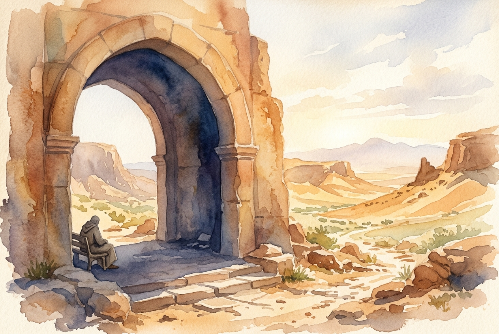

# Daily Reading: Psalm 91

*July 17, 2026*

> *(Image: A massive ancient stone archway casting a deep cool shadow over a rugged sun-drenched desert landscape, symbolizing shelter and quiet refuge.)*

## The Reading (NLT)

**Psalm 91**

> 1 Those who live in the shelter of the Most High will find rest in the shadow of the Almighty. 2 This I declare about the Lord: He alone is my refuge, my place of safety; he is my God, and I trust him. 3 For he will rescue you from every trap and protect you from deadly disease. 4 He will cover you with his feathers. He will shelter you with his wings. His faithful promises are your armor and protection. 5 Do not be afraid of the terrors of the night, nor the arrow that flies in the day. 6 Do not dread the disease that stalks in darkness, nor the disaster that strikes at midday. 7 Though a thousand fall at your side, though ten thousand are dying around you, these evils will not touch you. 8 Just open your eyes, and see how the wicked are punished. 9 If you make the Lord your refuge, if you make the Most High your shelter, 10 no evil will conquer you; no plague will come near your home. 11 For he will order his angels to protect you wherever you go. 12 They will hold you up with their hands so you won't even hurt your foot on a stone. 13 You will trample upon lions and cobras; you will crush fierce lions and serpents under your feet! 14 The Lord says, I will rescue those who love me. I will protect those who trust in my name. 15 When they call on me, I will answer; I will be with them in trouble. I will rescue and honor them. 16 I will reward them with a long life and give them my salvation.

## The Story

Ancient poetry often relied on vivid imagery to communicate profound theological truths. The psalmist paints a picture of a world fraught with danger, referencing traps, diseases, flying weapons, and predatory animals. Yet, against this chaotic backdrop, the writer introduces a contrasting space of absolute stillness and security. God is described using metaphors of an impenetrable fortress and a mother bird shielding her young. This language reflects an intimate, personal knowledge of the divine, shifting from general observations to a deeply individual declaration of trust. It culminates in a divine response, shifting the voice from the psalmist to God himself, affirming his enduring presence. The text acknowledges the reality of peril while insisting on the supremacy of divine shelter.

## Application for Today

We still live in a world where sudden disasters and hidden dangers cause deep anxiety. While this ancient song might sound like a blanket guarantee against all physical harm, the deeper promise is about ultimate spiritual security. It assures us that when we choose to dwell close to God, our fears lose their paralyzing power. The text explicitly notes that God promises his enduring presence during difficult times, rather than preventing every hardship from occurring. True refuge is found in the relationship itself, in knowing the character of the one who watches over us. By intentionally resting in that unseen shelter, we can navigate a frightening world with a quiet, resilient confidence. We are invited to trade our dread for an abiding trust in his faithful care.

---

*Scripture quotations are taken from the Holy Bible, New Living Translation, copyright © 1996, 2004, 2015 by Tyndale House Foundation. Used by permission of Tyndale House Publishers.*
