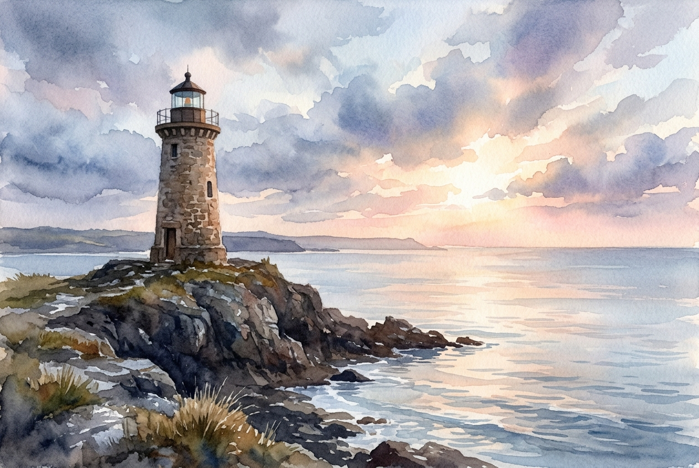

# Daily Reading: Romans 8:31-39

*July 17, 2026*

> *(Image: A sturdy stone lighthouse standing firm on a rocky cliff as gentle morning light breaks through a dissipating coastal storm, illuminating the calm waters below.)*

## The Reading (NLT)

**Romans 8:31-39**

> 31 What shall we say about such wonderful things as these? If God is for us, who can ever be against us? 32 Since he did not spare even his own Son but gave him up for us all, won't he also give us everything else? 33 Who dares accuse us whom God has chosen for his own? No one for God himself has given us right standing with himself. 34 Who then will condemn us? No one for Christ Jesus died for us and was raised to life for us, and he is sitting in the place of honor at God's right hand, pleading for us. 35 Can anything ever separate us from Christ's love? Does it mean he no longer loves us if we have trouble or calamity, or are persecuted, or hungry, or destitute, or in danger, or threatened with death? 36 (As the Scriptures say, For your sake we are killed every day; we are being slaughtered like sheep.) 37 No, despite all these things, overwhelming victory is ours through Christ, who loved us. 38 And I am convinced that nothing can ever separate us from God's love. Neither death nor life, neither angels nor demons, neither our fears for today nor our worries about tomorrow not even the powers of hell can separate us from God's love. 39 No power in the sky above or in the earth below indeed, nothing in all creation will ever be able to separate us from the love of God that is revealed in Christ Jesus our Lord.

## The Story

Paul wrote to a community in Rome that knew exactly what it meant to live in precarious times. The early Christians were vulnerable to political whims, social ostracization, and physical peril. In his letter, the apostle constructs a brilliant legal and cosmic argument to address their deepest vulnerabilities. He anticipates every possible threat they might face, from the mundane realities of hunger and poverty to the unseen forces of the spiritual realm. By listing these extreme scenarios, he acknowledges the harsh reality of their lived experience rather than dismissing their suffering. His rhetorical questions build a courtroom scene where all accusations fall flat. The ultimate verdict is not merely a legal acquittal, but a profound declaration of enduring affection.

## Application for Today

It is easy to look at the chaos around us and wonder if we have been left to fend for ourselves. When we face illness, financial ruin, or deep emotional pain, those struggles can feel like evidence of divine absence. Yet this passage flips that assumption entirely, assuring us that hardship is not a metric of our spiritual standing. We are invited to rest in the certainty that God's commitment to us survives our worst days. The love described here acts as an impenetrable shelter, holding us secure even when the world outside feels hostile and unpredictable. No matter what unravels in our lives, the core of our identity remains tethered to a grace that refuses to let go. We can face today knowing that absolutely nothing has the power to sever that connection.

---

*Scripture quotations are taken from the Holy Bible, New Living Translation, copyright © 1996, 2004, 2015 by Tyndale House Foundation. Used by permission of Tyndale House Publishers.*
