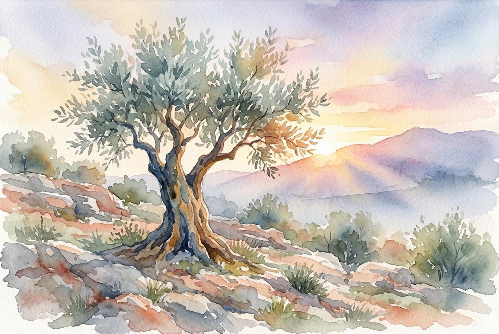

# Daily Reading: Romans 5:1-11

*July 18, 2026*

> *(Image: A single sturdy olive tree standing on a rocky hillside at dawn, its leaves catching the first warm rays of sunlight.)*

## The Reading (NLT)

**Romans 5:1-11**

> 1 Therefore, since we have been made right in God's sight by faith, we have peace with God because of what Jesus Christ our Lord has done for us. 2 Because of our faith, Christ has brought us into this place of undeserved privilege where we now stand, and we confidently and joyfully look forward to sharing God's glory. 3 We can rejoice, too, when we run into problems and trials, for we know that they help us develop endurance. 4 And endurance develops strength of character, and character strengthens our confident hope of salvation. 5 And this hope will not lead to disappointment. For we know how dearly God loves us, because he has given us the Holy Spirit to fill our hearts with his love. 6 When we were utterly helpless, Christ came at just the right time and died for us sinners. 7 Now, most people would not be willing to die for an upright person, though someone might perhaps be willing to die for a person who is especially good. 8 But God showed his great love for us by sending Christ to die for us while we were still sinners. 9 And since we have been made right in God's sight by the blood of Christ, he will certainly save us from God's condemnation. 10 For since our friendship with God was restored by the death of his Son while we were still his enemies, we will certainly be saved through the life of his Son. 11 So now we can rejoice in our wonderful new relationship with God because our Lord Jesus Christ has made us friends of God.

## The Story

In his letter to the Roman church, Paul transitions from theological arguments about faith to the lived reality of a transformed life. He uses the profound language of reconciliation to describe a shift in status from estranged enemies to welcomed friends. In the ancient Greco-Roman world, patronage was everything, and benefactors only extended favors to those who could offer loyalty or honor in return. Paul shatters this cultural expectation by describing a God who extends the ultimate sacrifice to people who had absolutely nothing to offer. The divine rescue mission was not launched for the righteous or the worthy, but for the helpless. This radical act of grace establishes a permanent peace treaty between humanity and God.

## Application for Today

It is easy to fall into the trap of believing we must earn our standing with God through good behavior or flawless faith. We often treat our spiritual lives like a transaction, hoping our good deeds outweigh our failures. Yet Paul reminds us that our peace with God was secured when we were at our absolute worst, entirely incapable of saving ourselves. If we were loved enough to be rescued in our weakest moments, we do not need to perform to maintain that love now. The struggles and trials we face today are not punishments, but spaces where our endurance and character are forged. We can stand securely in this unearned privilege, knowing that our ultimate hope is anchored in a love that has already proven its depth.

---

*Scripture quotations are taken from the Holy Bible, New Living Translation, copyright © 1996, 2004, 2015 by Tyndale House Foundation. Used by permission of Tyndale House Publishers.*
